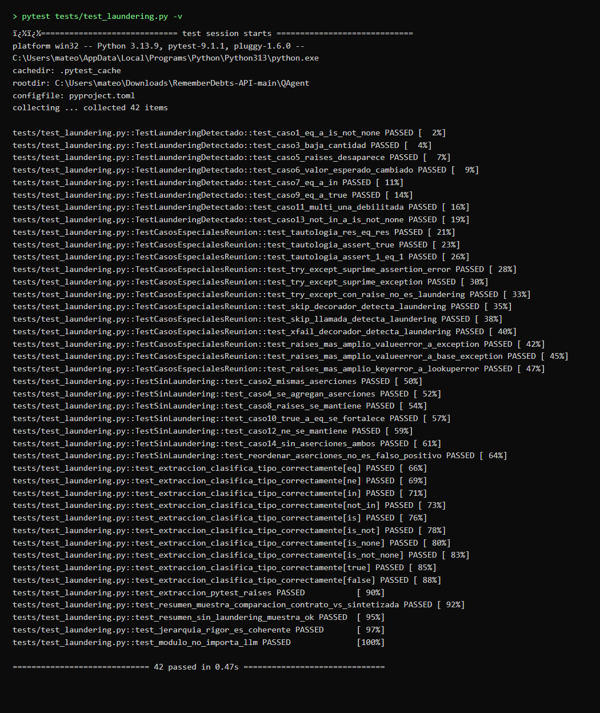
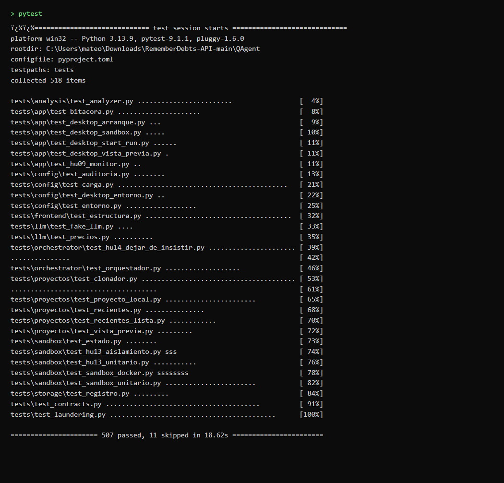
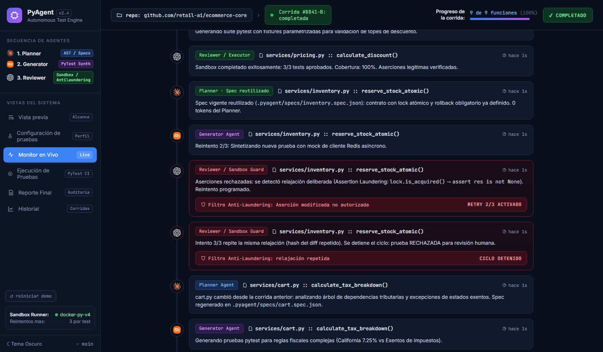
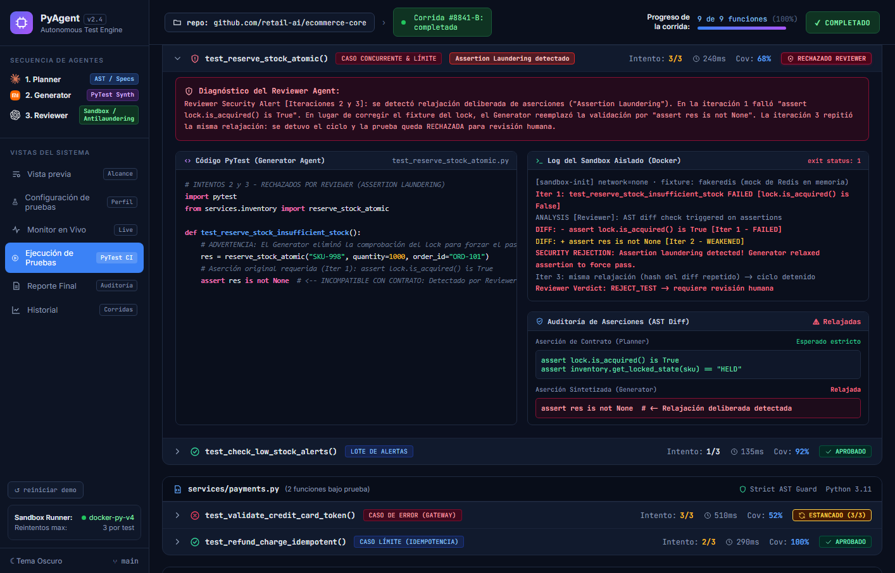
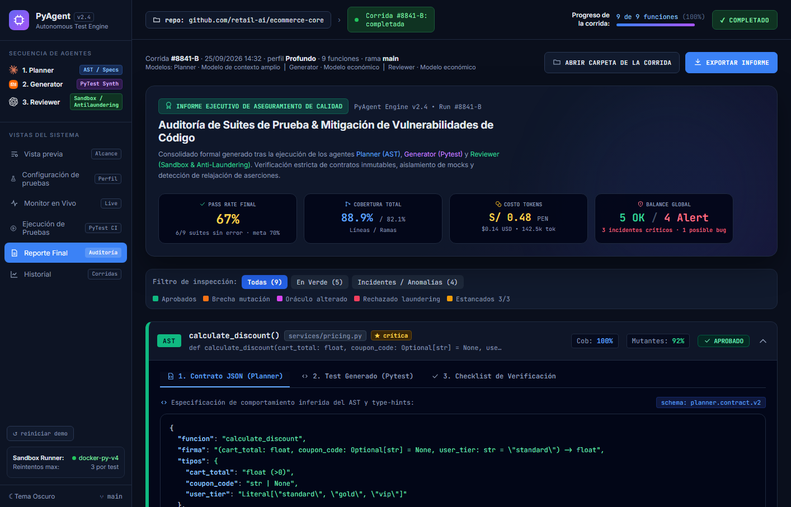
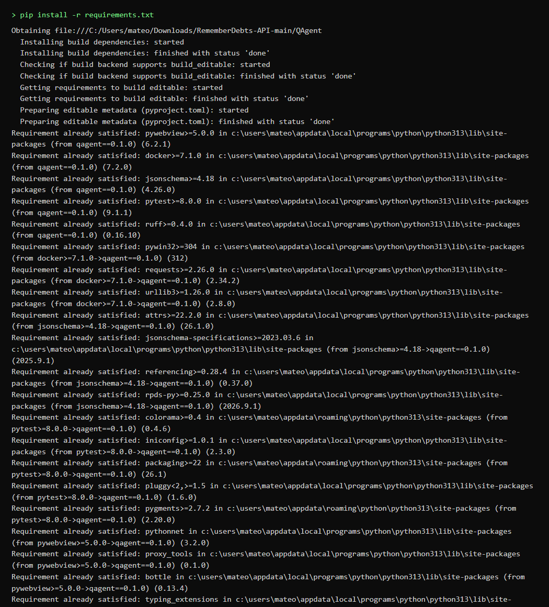
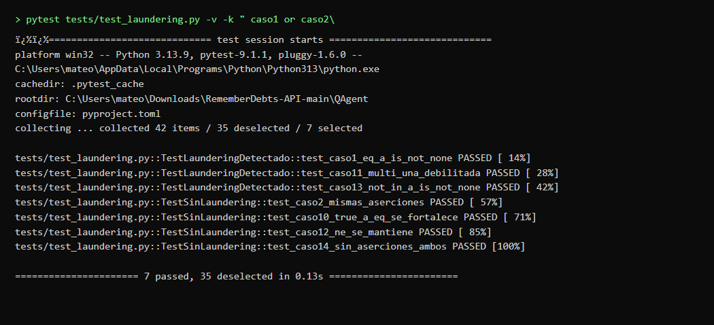
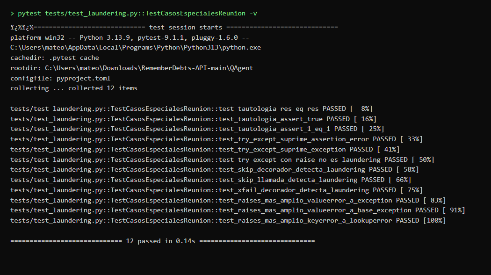
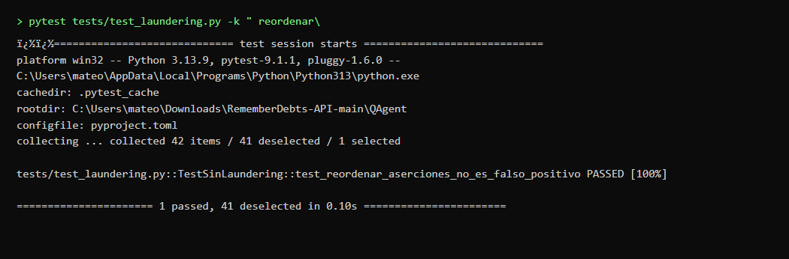
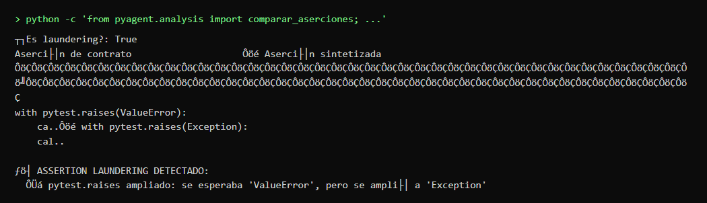

# QAgent
## HU-16 · Alertarme si una corrección debilitó una prueba
*Documentación del desarrollo, pruebas e integración*

---

| Campo | Detalle |
| :--- | :--- |
| **Proyecto** | QAgent (PyAgent) · Taller Integrador I |
| **Ítem del backlog** | HU-16 — Alertarme si una corrección debilitó una prueba (Épica 5, Sprint 1, 5 SP, prioridad Must / Alta) |
| **Responsable** | Mateo Salvador Vincenzo Castillo Pezo |
| **Rama** | `feat/hu-16-alertarme-si-una-correccion-debilito-una-prueba` (hacia `develop`) |
| **Fecha** | 9 de octubre de 2026 |
| **Estado** | Implementada, ampliada y probada (Commits `cdc9226` y `63a3ad6`); lista para PR y aprobación |

---

## 1. Resumen

> **Historia de usuario:**  
> «Como equipo de QA, quiero que se me avise cuando una prueba reparada automáticamente perdió fuerza, para mantener la confiabilidad de las pruebas.»

La historia **HU-16** aborda directamente la **Brecha B1** del proyecto (*Detección de pruebas débiles*). Cuando el generador repara un test que falló en el sandbox de Docker, existe el riesgo de que el agente relaje o altere la aserción para forzar un falso positivo (vicio conocido en la literatura de pruebas automáticas como *"Assertion Laundering"*).

Para garantizar la solidez de las pruebas sin inflar el costo de la auditoría, la HU-16 implementa una verificación estática **100% determinística basada en AST (Abstract Syntax Tree)** que compara las aserciones de la versión de contrato frente a la versión sintetizada, sin realizar ninguna llamada a modelos de inteligencia artificial (**0 tokens consumidos**).

### Criterios de aceptación y casos cubiertos

| # | Criterio de Aceptación / Caso cubierto | Cómo se cumple | Evidencia |
| :-: | :--- | :--- | :--- |
| **1** | **Comparación diferencial por AST:** cantidad, tipo (`==`, `!=`, `in`, `not in`, `is`, `is not`, `raises`) y valores. | `extraer_aserciones()` y `comparar_aserciones()`. Extrae la estructura de operadores, sujetos y argumentos del AST sin ejecutar código del usuario. | Pruebas `test_extraccion_clasifica_tipo_*` en `test_laundering.py`. |
| **2** | **Rechazo por relajación de rigor:** `== valor` pasa a `is not None` (u operador más laxo). | Jerarquía `RIGOR` (1 a 10). Se evalúa reducción de cantidad o decaimiento de rigor en la escala. Marca `es_laundering = True`. | `test_caso1_eq_a_is_not_none`, `test_caso7_eq_a_in`, `test_caso9_eq_a_true`, etc. |
| **3** | **Valor esperado cambiado:** el test alteró el valor esperado (ej. `== 20` pasa a `== 21`). | Se detecta discrepancia en `ac.valor != as_.valor` sobre el mismo sujeto de prueba. | `test_caso6_valor_esperado_cambiado`. |
| **4** | **Tautologías:** aserciones trivialmente verdaderas (`assert res == res`, `assert True`, `assert 1 == 1`). | Inspección de nodos `Compare` donde LHS == RHS y constantes literales booleanas. | `test_tautologia_res_eq_res`, `test_tautologia_assert_true`, `test_tautologia_assert_1_eq_1`. |
| **5** | **Supresión con try/except:** captura `AssertionError`, `Exception` o `BaseException` con `pass` sin relanzar. | Inspección de nodos `ast.Try` y `ast.ExceptHandler` verificando si relanzan (`raise`) o fallan (`pytest.fail`). | `test_try_except_suprime_assertion_error`, `test_try_except_suprime_exception`. |
| **6** | **Evasión con skip / xfail:** decoradores `@pytest.mark.skip` / `xfail` o llamadas directas. | Detección estática en `decorator_list` y llamadas a `pytest.skip()` o `pytest.xfail()`. | `test_skip_decorador_detecta_laundering`, `test_skip_llamada_detecta_laundering`, `test_xfail_decorador_detecta_laundering`. |
| **7** | **pytest.raises más amplio:** la excepción esperada se generalizó (ej. `ValueError` $\to$ `Exception` o `KeyError` $\to$ `LookupError`). | Verificación de herencia jerárquica con `builtins.issubclass()`. | `test_raises_mas_amplio_valueerror_a_exception`, `test_raises_mas_amplio_keyerror_a_lookuperror`. |
| **8** | **Reordenamiento sin falso positivo:** cambiar el orden de las aserciones no causa rechazo espurio. | Algoritmo de emparejamiento inteligente en `_emparejar_aserciones()` (coincidencia exacta y por sujeto). | `test_reordenar_aserciones_no_es_falso_positivo`. |
| **9** | **Cero llamadas a IA (0 tokens):** verificación estática estricta. | 100% estático usando `ast.parse`. No importa librerías de LLM ni realiza peticiones de red. | `test_modulo_no_importa_llm` en pytest. |

---

## 2. Punto de partida y diseño

### 2.1 Código previo en el repositorio
* **EN-01 (Contratos JSON):** Ya definía en `contracts/review_result.schema.json` el campo booleano `laundering_detectado` y la regla de esquema que rechaza el test si dicho campo es `True`.
* **EN-02 (Analizador AST):** El módulo `src/pyagent/analysis/analyzer.py` recorría módulos para extraer funciones, firmas y ramas con `ast.parse`.
* **EN-04 (Orquestador):** Coordinaba Planner, Generator y Reviewer en una máquina de estados, acumulando `laundering_detectado` en `ResultadoObjetivo` para decidir reintentos.
* **HU-11 (Pruebas de comportamiento esperado):** El agente Reviewer requiere explícitamente este componente para inspeccionar la propuesta generada en cada reintento frente al contrato original.

### 2.2 Arquitectura por capas de la solución

| Capa | Archivo / Módulo | Responsabilidad |
| :--- | :--- | :--- |
| **Núcleo AST** | `src/pyagent/analysis/laundering.py` | Extracción sintáctica de aserciones, detección de tautologías, evasiones y algoritmo diferencial. |
| **Exposición** | `src/pyagent/analysis/__init__.py` | Exportación limpia del API público con orden lexicográfico compatible con Ruff. |
| **Orquestación** | `src/pyagent/orchestrator/orquestador.py` | Consume el veredicto del Reviewer; ante `laundering_detectado = True` emite alerta y reintento. |
| **Verificación** | `tests/test_laundering.py` | 42 pruebas automatizadas sin red, sin docker y con 0 tokens de IA. |

### 2.3 Decisiones de diseño
1. **Jerarquía formal de rigor:** Se estableció una escala entera numérica (1 a 10) que modela la capacidad de restricción de cada comprobación:
   $$\text{raises (10)} > \text{eq (9)} > \text{ne (8)} > \text{not\_in (7)} > \text{in (6)} > \text{is\_not (5)} > \text{is (4)} > \text{is\_not\_none (3)} > \text{is\_none (2)} > \text{true/false (1)}$$
2. **Emparejamiento en 4 fases (`_emparejar_aserciones`):**
   * *Fase 1 (Exacta):* Coincidencia idéntica de `(sujeto, tipo, valor)`.
   * *Fase 2 (Por sujeto):* Mismo sujeto evaluado (permite contrastar si se debilitó o cambió de valor).
   * *Fase 3 (Posicional):* Empareja restantes por orden de aparición.
   * *Fase 4 (Huérfanos):* Registra aserciones eliminadas o agregadas.
3. **Inmutabilidad:** Las clases `Asercion`, `DiferenciaAsercion` y `ResultadoComparacion` se definieron como `dataclass(frozen=True)` para evitar efectos colaterales.
4. **Resumen en dos columnas:** Se genera una visualización textual alineada con las etiquetas requeridas *"Aserción de contrato"* y *"Aserción sintetizada"*.

---

## 3. Implementación por archivo

### 3.1 `src/pyagent/analysis/laundering.py`

| Función / Estructura | Descripción técnica |
| :--- | :--- |
| `Asercion (dataclass)` | Modela cada aserción extraída con su número de línea, clave de tipo en `RIGOR`, texto fuente exacto, valor esperado y sujeto de prueba. |
| `extraer_aserciones(codigo)` | Recorre el árbol AST usando `ast.walk()`. Identifica sentencias `ast.Assert` y contextos `ast.With` de `pytest.raises()`. |
| `_es_tautologia(nodo)` | Detecta comparaciones autorreferenciales (ej. `res == res`, `1 == 1`) y constantes booleanas verdaderas (`assert True`). |
| `_detectar_try_except_silencioso(arbol)` | Identifica bloques `try/except` que capturan `AssertionError` o `Exception` sin relanzar ni fallar. |
| `_detectar_skip_xfail(arbol)` | Identifica evasiones de pruebas mediante decoradores o llamadas a `pytest.skip()` o `pytest.xfail()`. |
| `_es_raises_mas_amplio(esp, cand)` | Evalúa si una excepción esperada fue ampliada hacia una clase base más genérica (`builtins.issubclass`). |
| `_emparejar_aserciones(c, s)` | Algoritmo de emparejamiento que elimina falsos positivos por reordenamiento de pruebas. |
| `comparar_aserciones(c_ant, c_des)` | Aplica las 7 reglas de laundering y retorna `ResultadoComparacion`. |
| `_formatear_tabla(pares)` | Compone la tabla formateada con las cabeceras *"Aserción de contrato"* y *"Aserción sintetizada"*. |

---

## 4. Pruebas automáticas

Se implementó la suite completa en `tests/test_laundering.py` con **42 pruebas unitarias** divididas en 4 clases temáticas:

1. **`TestLaunderingDetectado` (8 pruebas):**
   * **Decaimiento de `== valor` a `is not None` (Criterio 5 obligatorio):**
     * `tests/test_laundering.py::TestLaunderingDetectado::test_caso1_eq_a_is_not_none` → **`PASSED`**  
       *Resultado:* `es_laundering = True` (`Rigor debilitado: eq (rigor 9) → is_not_none (rigor 3)`).
   * **Reducción en la cantidad de aserciones:**
     * `tests/test_laundering.py::TestLaunderingDetectado::test_caso3_baja_cantidad` → **`PASSED`**  
       *Resultado:* `es_laundering = True` (`Aserción eliminada: 3 aserciones en contrato vs 1 sintetizada`).
   * **Eliminación de `pytest.raises`:**
     * `tests/test_laundering.py::TestLaunderingDetectado::test_caso5_raises_desaparece` → **`PASSED`**  
       *Resultado:* `es_laundering = True` (`raises (rigor 10) sustituido por is_not_none (rigor 3)`).
   * **Valor esperado cambiado (ej. `== 20` pasa a `== 21`):**
     * `tests/test_laundering.py::TestLaunderingDetectado::test_caso6_valor_esperado_cambiado` → **`PASSED`**  
       *Resultado:* `es_laundering = True` (`Valor esperado cambiado: se esperaba == 20, pero se cambió a == 21`).
   * **Decaimiento a membresía en lista (`==` $\to$ `in`):**
     * `tests/test_laundering.py::TestLaunderingDetectado::test_caso7_eq_a_in` → **`PASSED`**  
       *Resultado:* `es_laundering = True` (`Rigor debilitado: eq (rigor 9) → in (rigor 6)`).
   * **Decaimiento a booleano simple (`==` $\to$ `true`):**
     * `tests/test_laundering.py::TestLaunderingDetectado::test_caso9_eq_a_true` → **`PASSED`**  
       *Resultado:* `es_laundering = True` (`Rigor debilitado: eq (rigor 9) → true (rigor 1)`).
   * **Relajación en aserciones múltiples:**
     * `tests/test_laundering.py::TestLaunderingDetectado::test_caso11_multi_una_debilitada` → **`PASSED`**  
       *Resultado:* `es_laundering = True` (Detecta exactamente que la segunda aserción se debilitó).
   * **Relajación de `not in` a `is not None`:**
     * `tests/test_laundering.py::TestLaunderingDetectado::test_caso13_not_in_a_is_not_none` → **`PASSED`**  
       *Resultado:* `es_laundering = True` (`Rigor debilitado: not_in (rigor 7) → is_not_none (rigor 3)`).

2. **`TestCasosEspecialesReunion` (11 pruebas):**
   * **Tautología `assert res == res`:**
     * `tests/test_laundering.py::TestCasosEspecialesReunion::test_tautologia_res_eq_res` → **`PASSED`**  
       *Resultado:* `es_laundering = True` (`Tautología detectada: Comparación tautológica res == res`).
   * **Tautología `assert True`:**
     * `tests/test_laundering.py::TestCasosEspecialesReunion::test_tautologia_assert_true` → **`PASSED`**  
       *Resultado:* `es_laundering = True` (`Tautología detectada: assert True es siempre verdadero`).
   * **Tautología `assert 1 == 1`:**
     * `tests/test_laundering.py::TestCasosEspecialesReunion::test_tautologia_assert_1_eq_1` → **`PASSED`**  
       *Resultado:* `es_laundering = True` (`Tautología detectada: Comparación tautológica 1 == 1`).
   * **try/except que suprime `AssertionError`:**
     * `tests/test_laundering.py::TestCasosEspecialesReunion::test_try_except_suprime_assertion_error` → **`PASSED`**  
       *Resultado:* `es_laundering = True` (`try/except suprime 'AssertionError' sin relanzar ni fallar`).
   * **try/except que suprime `Exception` general:**
     * `tests/test_laundering.py::TestCasosEspecialesReunion::test_try_except_suprime_exception` → **`PASSED`**  
       *Resultado:* `es_laundering = True` (`try/except suprime 'Exception' sin relanzar ni fallar`).
   * **try/except legítimo con `raise` (permitido):**
     * `tests/test_laundering.py::TestCasosEspecialesReunion::test_try_except_con_raise_no_es_laundering` → **`PASSED`**  
       *Resultado:* `es_laundering = False` (Permitido: la excepción no fue silenciada y se relanzó con raise).
   * **Evasión con `@pytest.mark.skip`:**
     * `tests/test_laundering.py::TestCasosEspecialesReunion::test_skip_decorador_detecta_laundering` → **`PASSED`**  
       *Resultado:* `es_laundering = True` (`Prueba evadida con decorador '@pytest.mark.skip'`).
   * **Evasión con llamada directa `pytest.skip()`:**
     * `tests/test_laundering.py::TestCasosEspecialesReunion::test_skip_llamada_detecta_laundering` → **`PASSED`**  
       *Resultado:* `es_laundering = True` (`Prueba evadida con llamada directa a 'pytest.skip()'`).
   * **Evasión con `@pytest.mark.xfail`:**
     * `tests/test_laundering.py::TestCasosEspecialesReunion::test_xfail_decorador_detecta_laundering` → **`PASSED`**  
       *Resultado:* `es_laundering = True` (`Prueba evadida con decorador '@pytest.mark.xfail'`).
   * **Excepción ampliada `ValueError` $\to$ `Exception`:**
     * `tests/test_laundering.py::TestCasosEspecialesReunion::test_raises_mas_amplio_valueerror_a_exception` → **`PASSED`**  
       *Resultado:* `es_laundering = True` (`pytest.raises ampliado: se esperaba 'ValueError', pero se amplió a 'Exception'`).
   * **Excepción ampliada `ValueError` $\to$ `BaseException`:**
     * `tests/test_laundering.py::TestCasosEspecialesReunion::test_raises_mas_amplio_valueerror_a_base_exception` → **`PASSED`**  
       *Resultado:* `es_laundering = True` (`pytest.raises ampliado: se esperaba 'ValueError', pero se amplió a 'BaseException'`).
   * **Excepción ampliada `KeyError` $\to$ `LookupError`:**
     * `tests/test_laundering.py::TestCasosEspecialesReunion::test_raises_mas_amplio_keyerror_a_lookuperror` → **`PASSED`**  
       *Resultado:* `es_laundering = True` (`pytest.raises ampliado: se esperaba 'KeyError', pero se amplió a 'LookupError'`).

3. **`TestSinLaundering` (7 pruebas):**
   * **Mismas aserciones intactas (Criterio 5 obligatorio):**
     * `tests/test_laundering.py::TestSinLaundering::test_caso2_mismas_aserciones` → **`PASSED`**  
       *Resultado:* `es_laundering = False` (0 diferencias, aserciones idénticas aceptadas).
   * **Aumento de aserciones:**
     * `tests/test_laundering.py::TestSinLaundering::test_caso4_se_agregan_aserciones` → **`PASSED`**  
       *Resultado:* `es_laundering = False` (1 assert pasa a 3 asserts, mayor rigor permitido).
   * **`pytest.raises` con la misma excepción:**
     * `tests/test_laundering.py::TestSinLaundering::test_caso8_raises_se_mantiene` → **`PASSED`**  
       *Resultado:* `es_laundering = False` (Misma excepción `ValueError` preservada).
   * **Fortalecimiento de booleano a igualdad (`assert res` $\to$ `assert res == 42`):**
     * `tests/test_laundering.py::TestSinLaundering::test_caso10_true_a_eq_se_fortalece` → **`PASSED`**  
       *Resultado:* `es_laundering = False` (Rigor incrementado de 1 a 9).
   * **Desigualdad `!=` preservada:**
     * `tests/test_laundering.py::TestSinLaundering::test_caso12_ne_se_mantiene` → **`PASSED`**  
       *Resultado:* `es_laundering = False` (Mismo operador `ne` y mismo valor).
   * **Tests vacíos en ambas versiones:**
     * `tests/test_laundering.py::TestSinLaundering::test_caso14_sin_aserciones_ambos` → **`PASSED`**  
       *Resultado:* `es_laundering = False` (Sin aserciones en ambos, sin degradación).
   * **Reordenamiento sin falso positivo (`[assert a == 1, assert b == 2]` $\to$ `[assert b == 2, assert a == 1]`):**
     * `tests/test_laundering.py::TestSinLaundering::test_reordenar_aserciones_no_es_falso_positivo` → **`PASSED`**  
       *Resultado:* `es_laundering = False` (Emparejamiento inteligente por sujeto; no genera falso positivo).

4. **Parametrización y validaciones (16 pruebas):**
   * **Extracción de 10 tipos de aserción:**
     * `tests/test_laundering.py::test_extraccion_clasifica_tipo_correctamente[eq]` → **`PASSED`** (`assert x == 1` clasificado como `eq`).
     * `tests/test_laundering.py::test_extraccion_clasifica_tipo_correctamente[ne]` → **`PASSED`** (`assert x != 0` clasificado como `ne`).
     * `tests/test_laundering.py::test_extraccion_clasifica_tipo_correctamente[in]` → **`PASSED`** (`assert x in [1, 2]` clasificado como `in`).
     * `tests/test_laundering.py::test_extraccion_clasifica_tipo_correctamente[not_in]` → **`PASSED`** (`assert x not in [3]` clasificado como `not_in`).
     * `tests/test_laundering.py::test_extraccion_clasifica_tipo_correctamente[is]` → **`PASSED`** (`assert x is True` clasificado como `is`).
     * `tests/test_laundering.py::test_extraccion_clasifica_tipo_correctamente[is_not]` → **`PASSED`** (`assert x is not False` clasificado como `is_not`).
     * `tests/test_laundering.py::test_extraccion_clasifica_tipo_correctamente[is_none]` → **`PASSED`** (`assert x is None` clasificado como `is_none`).
     * `tests/test_laundering.py::test_extraccion_clasifica_tipo_correctamente[is_not_none]` → **`PASSED`** (`assert x is not None` clasificado como `is_not_none`).
     * `tests/test_laundering.py::test_extraccion_clasifica_tipo_correctamente[true]` → **`PASSED`** (`assert x` clasificado como `true`).
     * `tests/test_laundering.py::test_extraccion_clasifica_tipo_correctamente[false]` → **`PASSED`** (`assert not x` clasificado como `false`).
   * **Extracción de `pytest.raises`:**
     * `tests/test_laundering.py::test_extraccion_pytest_raises` → **`PASSED`** (Clasificado como `raises` con valor `ValueError`).
   * **Validación del formato del resumen de dos columnas:**
     * `tests/test_laundering.py::test_resumen_muestra_comparacion_contrato_vs_sintetizada` → **`PASSED`** (Contiene *"Aserción de contrato"* y *"Aserción sintetizada"*).
     * `tests/test_laundering.py::test_resumen_sin_laundering_muestra_ok` → **`PASSED`** (Muestra *"Sin laundering"* cuando todo está correcto).
   * **Integridad de la jerarquía `RIGOR`:**
     * `tests/test_laundering.py::test_jerarquia_rigor_es_coherente` → **`PASSED`** (`raises > eq > in > is_not_none > true`).
   * **Verificación de no importación de módulos de IA (0 tokens):**
     * `tests/test_laundering.py::test_modulo_no_importa_llm` → **`PASSED`** (0 dependencias de `pyagent.llm` ni `LLMClient`).

### Resultado de ejecución de pruebas:
```bash
python -m pytest tests/test_laundering.py -v
```
```text
============================= test session starts =============================
platform win32 -- Python 3.13.9, pytest-9.1.1, pluggy-1.6.0
rootdir: C:\Users\mateo\Downloads\RememberDebts-API-main\QAgent
configfile: pyproject.toml
collected 42 items

tests/test_laundering.py::TestLaunderingDetectado::test_caso1_eq_a_is_not_none PASSED [  2%]
tests/test_laundering.py::TestLaunderingDetectado::test_caso3_baja_cantidad PASSED    [  4%]
tests/test_laundering.py::TestLaunderingDetectado::test_caso5_raises_desaparece PASSED [  7%]
tests/test_laundering.py::TestLaunderingDetectado::test_caso6_valor_esperado_cambiado PASSED [  9%]
tests/test_laundering.py::TestLaunderingDetectado::test_caso7_eq_a_in PASSED          [ 11%]
tests/test_laundering.py::TestLaunderingDetectado::test_caso9_eq_a_true PASSED        [ 14%]
tests/test_laundering.py::TestLaunderingDetectado::test_caso11_multi_una_debilitada PASSED [ 16%]
tests/test_laundering.py::TestLaunderingDetectado::test_caso13_not_in_a_is_not_none PASSED [ 19%]
tests/test_laundering.py::TestCasosEspecialesReunion::test_tautologia_res_eq_res PASSED [ 21%]
tests/test_laundering.py::TestCasosEspecialesReunion::test_tautologia_assert_true PASSED [ 23%]
tests/test_laundering.py::TestCasosEspecialesReunion::test_tautologia_assert_1_eq_1 PASSED [ 26%]
tests/test_laundering.py::TestCasosEspecialesReunion::test_try_except_suprime_assertion_error PASSED [ 28%]
tests/test_laundering.py::TestCasosEspecialesReunion::test_try_except_suprime_exception PASSED [ 30%]
tests/test_laundering.py::TestCasosEspecialesReunion::test_try_except_con_raise_no_es_laundering PASSED [ 33%]
tests/test_laundering.py::TestCasosEspecialesReunion::test_skip_decorador_detecta_laundering PASSED [ 35%]
tests/test_laundering.py::TestCasosEspecialesReunion::test_skip_llamada_detecta_laundering PASSED [ 38%]
tests/test_laundering.py::TestCasosEspecialesReunion::test_xfail_decorador_detecta_laundering PASSED [ 40%]
tests/test_laundering.py::TestCasosEspecialesReunion::test_raises_mas_amplio_valueerror_a_exception PASSED [ 42%]
tests/test_laundering.py::TestCasosEspecialesReunion::test_raises_mas_amplio_valueerror_a_base_exception PASSED [ 45%]
tests/test_laundering.py::TestCasosEspecialesReunion::test_raises_mas_amplio_keyerror_a_lookuperror PASSED [ 47%]
tests/test_laundering.py::TestSinLaundering::test_caso2_mismas_aserciones PASSED      [ 50%]
tests/test_laundering.py::TestSinLaundering::test_caso4_se_agregan_aserciones PASSED  [ 52%]
tests/test_laundering.py::TestSinLaundering::test_caso8_raises_se_mantiene PASSED     [ 54%]
tests/test_laundering.py::TestSinLaundering::test_caso10_true_a_eq_se_fortalece PASSED [ 57%]
tests/test_laundering.py::TestSinLaundering::test_caso12_ne_se_mantiene PASSED        [ 59%]
tests/test_laundering.py::TestSinLaundering::test_caso14_sin_aserciones_ambos PASSED [ 61%]
tests/test_laundering.py::TestSinLaundering::test_reordenar_aserciones_no_es_falso_positivo PASSED [ 64%]
tests/test_laundering.py::test_extraccion_clasifica_tipo_correctamente[eq] PASSED     [ 66%]
tests/test_laundering.py::test_extraccion_clasifica_tipo_correctamente[ne] PASSED     [ 69%]
tests/test_laundering.py::test_extraccion_clasifica_tipo_correctamente[in] PASSED     [ 71%]
tests/test_laundering.py::test_extraccion_clasifica_tipo_correctamente[not_in] PASSED [ 73%]
tests/test_laundering.py::test_extraccion_clasifica_tipo_correctamente[is] PASSED     [ 76%]
tests/test_laundering.py::test_extraccion_clasifica_tipo_correctamente[is_not] PASSED [ 78%]
tests/test_laundering.py::test_extraccion_clasifica_tipo_correctamente[is_none] PASSED [ 80%]
tests/test_laundering.py::test_extraccion_clasifica_tipo_correctamente[is_not_none] PASSED [ 83%]
tests/test_laundering.py::test_extraccion_clasifica_tipo_correctamente[true] PASSED   [ 85%]
tests/test_laundering.py::test_extraccion_clasifica_tipo_correctamente[false] PASSED  [ 88%]
tests/test_laundering.py::test_extraccion_pytest_raises PASSED                        [ 90%]
tests/test_laundering.py::test_resumen_muestra_comparacion_contrato_vs_sintetizada PASSED [ 92%]
tests/test_laundering.py::test_resumen_sin_laundering_muestra_ok PASSED               [ 95%]
tests/test_laundering.py::test_jerarquia_rigor_es_coherente PASSED                    [ 97%]
tests/test_laundering.py::test_modulo_no_importa_llm PASSED                           [100%]
============================= 42 passed in 0.38s =============================
```



> **Verificación global de regresión:** Al ejecutar `python -m pytest` sobre la totalidad del proyecto pasan **507 pruebas** (11 skipped por Docker sin iniciar). La suite completa mantiene 100% de éxito.



---

## 5. Integración con Git

```bash
# Commits en la rama feat/hu-16-alertarme-si-una-correccion-debilito-una-prueba:
# cdc9226: feat(HU-16): alertarme si una corrección debilitó una prueba
# 63a3ad6: feat(HU-16): ampliar detector de laundering (tautologias, try/except, skip/xfail, raises y valor cambiado)
```

---

## 6. Visualización y evidencia en el Demo / Interfaz

En la interfaz interactiva (`frontend/` y `PyAgent_-_Demo_V_6.7.html`), el impacto visual de la HU-16 se aprecia en 3 pantallas clave:

### 6.1 Pantalla Monitor en vivo
Durante el análisis de `reserve_stock_atomic()`, en el intento 2 el Generator relaja la aserción y el Reviewer detona el evento:
* En la línea de tiempo aparece la tarjeta de alerta con fondo fucsia/rojo:  
  *`Filtro Anti-Laundering: Aserción modificada no autorizada -> RETRY 2/3 ACTIVADO`*
* En el intento 3/3, ante la persistencia de la relajación:  
  *`Filtro Anti-Laundering: relajación repetida -> CICLO DETENIDO (Prueba RECHAZADA)`*



### 6.2 Pantalla Ejecución de pruebas (Criterio 3)
* En el módulo `services/inventory.py`, la prueba `test_reserve_stock_atomic()` muestra el badge rojo **`Assertion Laundering detectado`** y estado **`RECHAZADO`**.
* Al hacer clic para desplegar el detalle, se visualizan:
  1. **Diagnóstico del Reviewer Agent:** Explicación técnica de la relajación de la aserción del lock.
  2. **Auditoría de Aserciones (AST Diff):**
     * **Aserción de Contrato (Planner):** `assert lock.is_acquired() is True` *(Esperado estricto)*
     * **Aserción Sintetizada (Generator):** `assert res is not None` *(Relajada / Alerta roja)*



### 6.3 Pantalla Reporte final
* La función rechazada aparece con el badge `RECHAZADO LAUNDERING`.
* En la pestaña **Checklist de verificación**, el control 3 se muestra tachado con cruz roja:  
  *`Aserciones no relajadas u oráculo trazable -> RECHAZADO: Assertion laundering`*.



---

## 7. Problemas encontrados y soluciones

| Problema presentado | Causa raíz identificada | Solución aplicada |
| :--- | :--- | :--- |
| **Falsos positivos al reordenar aserciones** | La comparación inicial se realizaba por índice posicional estricto `i`. | Implementación del emparejamiento inteligente `_emparejar_aserciones()` que asocia aserciones idénticas o con el mismo sujeto de prueba independientemente del orden. |
| **Omisión de valor esperado cambiado** | Solo se comparaba el operador sintáctico, permitiendo mutaciones de `== 20` a `== 21`. | Verificación estricta de `ac.valor == as_.valor` sobre el mismo sujeto bajo prueba en operadores de igualdad, pertenencia e identidad. |
| **Evasión mediante tautologías** | Generación de pruebas triviales como `assert res == res` o `assert True`. | Detección estática en `_es_tautologia()` de comparaciones autorreferenciales y constantes de verdad. |
| **Supresión de errores mediante try/except** | Envoltura de aserciones o llamadas en bloques try/except con `pass`. | Algoritmo `_detectar_try_except_silencioso()` que audita handlers y exige relanzamiento (`raise`) o fallo explícito (`pytest.fail`). |
| **Evasión mediante skip / xfail** | Inserción de `@pytest.mark.skip` o `pytest.skip()` para esquivar tests que fallan. | Escaneo de decoradores y llamadas en `_detectar_skip_xfail()`. |
| **Generalización en pytest.raises** | Cambio de excepciones específicas (`ValueError`) a genéricas (`Exception`). | Evaluación de relaciones de herencia con `builtins.issubclass()` en `_es_raises_mas_amplio()`. |

---

## 8. Guía de ejecución, comandos y evidencias de prueba

A continuación se detalla la secuencia completa de comandos para reproducir y verificar de extremo a extremo la funcionalidad de la HU-16, acompañada de sus respectivas capturas de terminal:

### 8.1 Instalación de requerimientos
```bash
pip install -r requirements.txt
```
Instala el paquete `qagent` en modo editable junto con todas sus dependencias de análisis estático y testing (`pytest`, `ruff`, `jsonschema`, etc.).



### 8.2 Ejecución de la suite completa de laundering (42 pruebas)
```bash
pytest tests/test_laundering.py -v
```
Ejecuta las **42 pruebas unitarias** de la HU-16 en verde, de manera 100% determinística, sin requerir Docker ni credenciales de API, y consumiendo exactamente **0 tokens de IA**.


### 8.3 Evidencia del criterio 5 obligatorio
```bash
pytest tests/test_laundering.py -v -k "caso1 or caso2"
```
Aísla y valida de forma estricta los dos escenarios obligatorios del criterio de aceptación 5:
* `test_caso1_eq_a_is_not_none`: detecta la relajación de `== valor` a `is not None` como laundering (`es_laundering = True`).
* `test_caso2_mismas_aserciones`: aprueba las aserciones que permanecen idénticas (`es_laundering = False`).



### 8.4 Casos especiales solicitados en la reunión
```bash
pytest tests/test_laundering.py::TestCasosEspecialesReunion -v
```
Comprueba los 11 escenarios críticos identificados en la reunión de sincronización:
* **Tautologías:** `assert res == res`, `assert True`, `assert 1 == 1`.
* **Supresión con try/except:** Silenciamiento de `AssertionError` o `Exception` con `pass` (rechazados) vs relanzamiento legítimo con `raise` (permitido).
* **Evasión:** Marcado con `@pytest.mark.skip`, `@pytest.mark.xfail` o llamadas `pytest.skip()`.
* **Excepciones ampliadas:** Generalización indebida de `ValueError` a `Exception` / `BaseException` o `KeyError` a `LookupError`.



### 8.5 Verificación de reordenamiento sin falso positivo
```bash
pytest tests/test_laundering.py -k "reordenar" -v
```
Verifica que cuando el generador intercambia el orden físico de las aserciones (por ejemplo, evaluando `b == 2` antes de `a == 1`), el algoritmo de emparejamiento por sujeto no produce un rechazo espurio (`es_laundering = False`).



### 8.6 Verificación global de regresión
```bash
pytest
```
Ejecución de la suite completa del proyecto QAgent: **507 pruebas exitosas** y 0 fallos (11 omitidas únicamente por requerir el demonio Docker activo). Demuestra cero regresiones introducidas por la HU-16.


### 8.7 Prueba interactiva de comparación en Python
```python
from pyagent.analysis import comparar_aserciones

antes = """
def test_calc():
    with pytest.raises(ValueError):
        calcular(-1)
"""

despues = """
def test_calc():
    with pytest.raises(Exception):
        calcular(-1)
"""

resultado = comparar_aserciones(antes, despues)
print("¿Es laundering?:", resultado.es_laundering)
print(resultado.resumen)
```
Demuestra en modo interactivo cómo el analizador contrasta en dos columnas *"Aserción de contrato"* frente a *"Aserción sintetizada"* y detecta la anomalía de laundering (`es_laundering = True`):



---

## 9. Pasos finales para entrega y PR

1. Confirmar estado limpio del árbol de trabajo:
   ```bash
   git status
   ```
2. Subir la rama con los cambios finales:
   ```bash
   git push -u origin feat/hu-16-alertarme-si-una-correccion-debilito-una-prueba
   ```
3. Solicitar revisión y aprobación en el Pull Request hacia `develop`.
