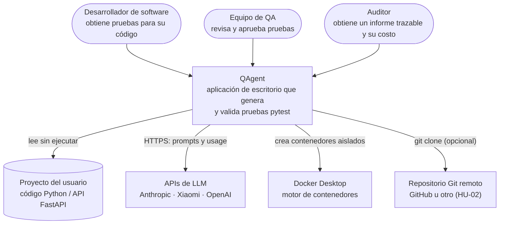
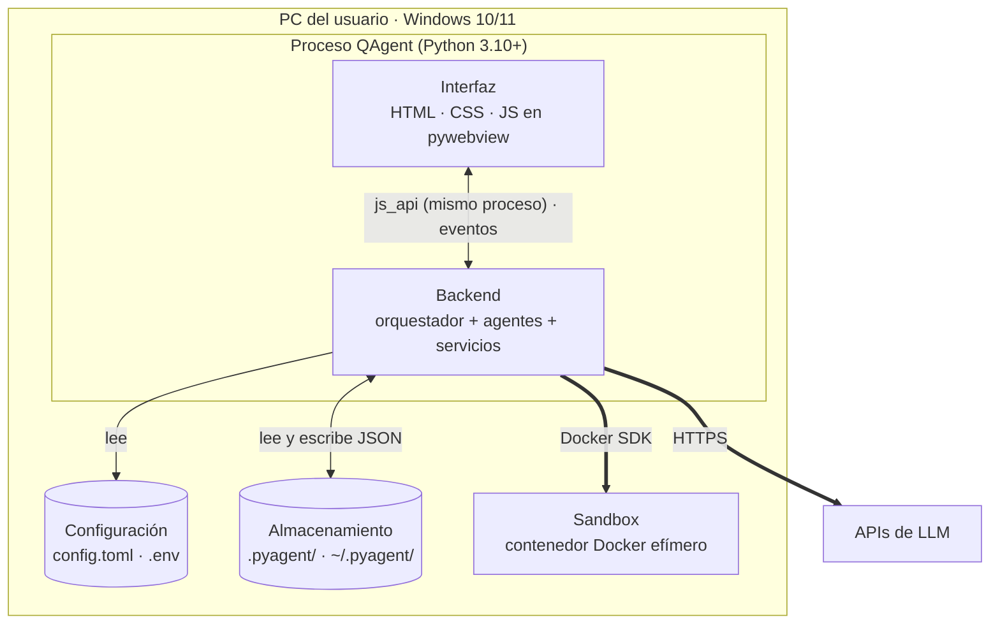
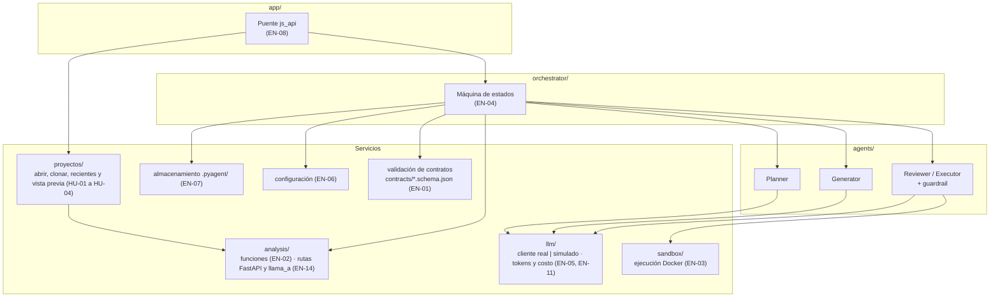
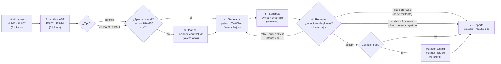
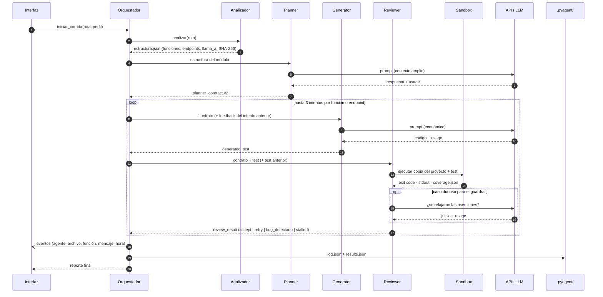
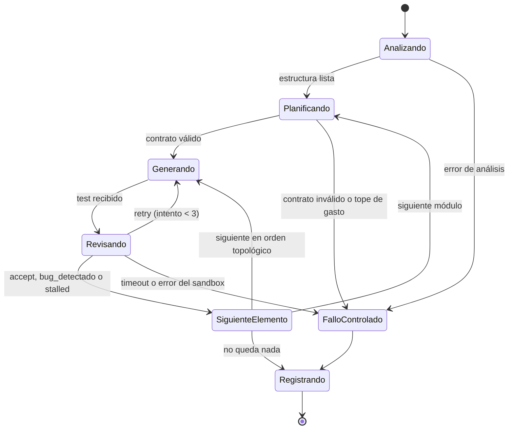
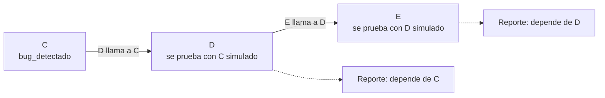
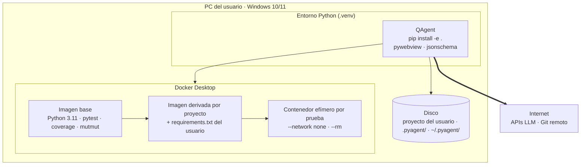
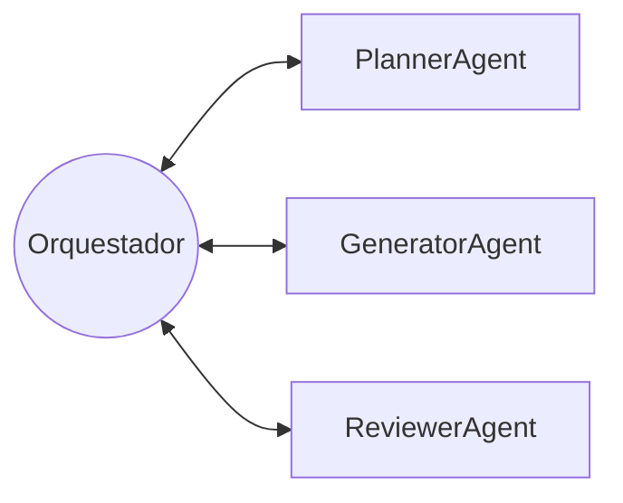

# Arquitectura de QAgent

> **Ítem:** EN-01 — Arquitectura GAIA y contratos JSON · **Responsable:** Oncoy Patricio, Angel · **Estado:** borrador para aprobación del equipo

QAgent genera y valida pruebas pytest para código Python 3.10+: **pruebas unitarias de funciones** y **pruebas de endpoints FastAPI**. Tres agentes basados en LLM (Planner, Generator y Reviewer) trabajan bajo un orquestador determinista, y todas las pruebas se ejecutan en un sandbox Docker aislado.

El documento sigue el **modelo C4** (Contexto → Contenedores → Componentes) y lo completa con vistas dinámicas, despliegue, el modelo GAIA de los agentes y las decisiones de diseño.

**Contenido**

1. [Estilo de arquitectura](#1-estilo-de-arquitectura)
2. [Nivel 1 · Contexto](#2-nivel-1--contexto)
3. [Nivel 2 · Contenedores](#3-nivel-2--contenedores)
4. [Nivel 3 · Componentes del backend](#4-nivel-3--componentes-del-backend)
5. [Vistas dinámicas](#5-vistas-dinámicas)
6. [Vista de despliegue](#6-vista-de-despliegue)
7. [Modelo GAIA](#7-modelo-gaia)
8. [Contratos JSON](#8-contratos-json)
9. [Stack tecnológico](#9-stack-tecnológico)
10. [Decisiones de arquitectura](#10-decisiones-de-arquitectura)
11. [Aprobación](#11-aprobación)

---

## 1. Estilo de arquitectura

**QAgent es un monolito modular en capas, de escritorio, con un pipeline multiagente orquestado.**

| Característica | Qué significa en QAgent |
|---|---|
| **Monolito** | Toda la aplicación (interfaz, orquestador, agentes y servicios) se instala y se ejecuta como **un solo programa** en la PC del usuario, en **un solo proceso Python**. No hay servicios separados que se desplieguen por su cuenta. |
| **Modular** | Por dentro, el código está dividido en módulos con una responsabilidad cada uno (`agents`, `analysis`, `sandbox`, `llm`, `orchestrator`, `app`) que se comunican por contratos JSON y reglas de dependencia (sección 4). |
| **En capas** | Presentación → aplicación → datos. Cada capa solo usa la de abajo. |
| **Pipeline orquestado** | Cada función pasa por etapas fijas (analizar → planificar → generar → ejecutar y revisar → reportar), dirigidas por una máquina de estados. |
| **Multiagente (GAIA)** | Las etapas que requieren criterio las cumplen agentes con roles, permisos y protocolos definidos (sección 7). |

### Por qué monolito y no otra opción

| Alternativa | Por qué no aplica a QAgent |
|---|---|
| **Microservicios** | Tiene sentido cuando varias partes escalan o se despliegan por separado y hay muchos usuarios concurrentes. QAgent tiene un usuario por instalación, 4 desarrolladores y un semestre: separar en servicios agregaría red, despliegue y fallos entre servicios sin ningún beneficio. |
| **Cliente-servidor** | Requiere un servidor propio que atienda a varios clientes. En QAgent la interfaz y el backend corren en el mismo proceso: pywebview expone funciones Python a JavaScript directamente (`js_api`), sin HTTP. |
| **Aplicación web** | Obligaría a subir el código del usuario a un servidor. QAgent analiza el código localmente y solo envía a las APIs de IA el resumen que necesita cada agente. |

La relación cliente-servidor solo aparece **hacia afuera**: el backend es cliente de las APIs de los LLM (HTTPS) y del motor de Docker (socket local). El sandbox es un **proceso aparte** a propósito, por seguridad, pero no es un servicio de QAgent: es un contenedor efímero que se crea y destruye en cada prueba.

---

## 2. Nivel 1 · Contexto

Quién usa QAgent y con qué sistemas externos se relaciona.



| Actor o sistema | Relación con QAgent |
|---|---|
| Desarrollador de software | Abre su proyecto, lanza la corrida y obtiene pruebas listas para su repositorio. |
| Equipo de QA | Revisa las pruebas, las alertas de laundering y los mutantes sobrevivientes. |
| Auditor | Consulta el costo estimado y real, el historial y el informe exportable. |
| Proyecto del usuario | Fuente del análisis estático. Nunca se ejecuta fuera del sandbox. |
| APIs de LLM | Un modelo por agente (ADR-001). Única salida a internet con información del proyecto. |
| Docker Desktop | Ejecuta las pruebas en contenedores sin red. |
| Repositorio Git remoto | Opcional: clonar un proyecto público por URL. |

---

## 3. Nivel 2 · Contenedores

En C4, un "contenedor" es cualquier pieza que se ejecuta o guarda datos por separado (no necesariamente Docker).



| Contenedor | Tecnología | Responsabilidad | Ítems |
|---|---|---|---|
| **Interfaz** | HTML, CSS, JS dentro de pywebview (carpeta `frontend/`, sin compilación; un componente por pantalla, ver ADR-003) | Pantallas: Bienvenida, Vista previa, Monitor en vivo, Ejecución, Reporte, Historial, Configuración | EN-08, HU-* |
| **Backend** | Python 3.10+ | Análisis, orquestación, agentes, cálculo de métricas y costo | EN-02 a EN-07, EN-14, EN-15 |
| **Configuración** | TOML + variables de entorno | Modelos, precios, topes y reintentos (`config.toml`, se versiona); claves de API (`.env`, no se versiona) | EN-06 |
| **Almacenamiento** | Archivos JSON | `.pyagent/` dentro del proyecto analizado: corridas, specs, pruebas aprobadas. `~/.pyagent/recientes.json`: proyectos recientes | EN-07, HU-01, HU-03 |
| **Sandbox** | Docker (Python 3.11, pytest, coverage, mutmut, fastapi, httpx) | Ejecutar cada prueba aislada: `--network none`, `--rm`, 1 CPU, 256 MB, 60 s | EN-03, EN-09, EN-15 |

---

## 4. Nivel 3 · Componentes del backend



| Componente | Carpeta | Responsabilidad | Ítems |
|---|---|---|---|
| Puente js_api | `src/pyagent/app/` | Recibe las acciones de la interfaz (`desktop.py`) y le envía eventos. No contiene lógica de negocio. | EN-08 |
| Proyectos | `src/pyagent/proyectos/` | Lógica de los proyectos del usuario: abrir una carpeta, clonar un repositorio, lista de recientes y vista previa. Sin dependencia de pywebview. | HU-01 a HU-04 |
| Orquestador | `src/pyagent/orchestrator/` | Máquina de estados de la corrida: ordena funciones por dependencias (`llama_a`), reparte trabajo, controla reintentos, topes de gasto y fallos. Sin LLM. | EN-04 |
| Planner | `src/pyagent/agents/` | Diseña casos de prueba y valores esperados por función o endpoint. | HU-11, HU-27 |
| Generator | `src/pyagent/agents/` | Escribe el test pytest de una función o endpoint. | HU-11, EN-15 |
| Reviewer / Executor | `src/pyagent/agents/` | Ejecuta en el sandbox, detecta laundering y decide. | HU-14, HU-16 |
| Analizador | `src/pyagent/analysis/` | Análisis estático con `ast`: firmas, tipos, docstrings, ramas, rutas FastAPI, `llama_a`, SHA-256. | EN-02, EN-14 |
| Cliente LLM | `src/pyagent/llm/` | Llama a la API del modelo de cada agente (o a la IA simulada) y registra el `usage`. | EN-05, EN-11 |
| Sandbox | `src/pyagent/sandbox/` | Prepara la imagen, copia el proyecto y ejecuta pytest, coverage y mutmut. | EN-03, EN-09 |
| Almacenamiento | `src/pyagent/storage/` | Lee y escribe `.pyagent/runs`, `specs`, `tests`. | EN-07 |
| Configuración | `src/pyagent/config/` | Carga `config.toml` y `.env`, audita las claves y verifica Docker y Git. | EN-06 |
| Contratos | `contracts/` | JSON Schema de cada mensaje; se validan en cada paso. | EN-01 |

### Reglas de dependencia

1. `app/` solo llama al orquestador y a los servicios (por ejemplo `proyectos/`); no contiene lógica de negocio.
2. El orquestador puede usar agentes y servicios.
3. **Los agentes no se importan entre sí** ni importan al orquestador. Solo reciben y devuelven contratos.
4. Los agentes usan el Cliente LLM; solo el Reviewer usa el Sandbox.
5. Ningún componente ejecuta el código del usuario fuera del Sandbox.
6. **Los servicios no dependen de la interfaz:** `proyectos/`, `analysis/`, `sandbox/`, `llm/` y `storage/` nunca importan `pyagent.app` ni pywebview. Así se prueban sin ventana.

---

## 5. Vistas dinámicas

### 5.1 Pipeline de una corrida

Cada función o endpoint seleccionado pasa por estas etapas, en **orden de dependencias** (sección 5.4). Entre paréntesis, dónde se gastan tokens.



| Etapa | Qué produce | Métrica que alimenta |
|---|---|---|
| Sandbox | exit code, stdout/stderr, `coverage.json` | Pass Rate, cobertura de líneas y ramas |
| Reviewer | `review_result` con n.º de intento | Iteraciones de autorreparación |
| Cliente LLM | `usage` de cada llamada | Tokens por agente (`prompt_tokens` + `completion_tokens`) |
| Mutation testing | mutantes muertos / totales | Mutation Score (solo funciones críticas) |

### 5.2 Flujo de información

Mensajes, en orden, para una función o endpoint.



### 5.3 Máquina de estados del orquestador

Base para EN-04.



- **Fallo controlado:** la corrida no se cuelga. Se registra el motivo y se escriben `log.json` y `results.json` con lo que se alcanzó a procesar.
- **Tope de gasto:** antes de cada llamada al LLM, el orquestador compara el gasto acumulado con `tope_por_corrida_usd` de `config.toml`.
- **Un reintento nunca vuelve al Planner.** El plan se hace una vez por módulo y se reutiliza (HU-24); un reintento solo repite Generator → Reviewer para ese test.

### 5.4 Manejo de fallos y dependencias

**Problema:** de 5 pruebas A, B, C, D, E, pasan A y B; C falla, y D y E fallan "por culpa" de C (D usa C, E usa D). ¿Hay que rehacer el plan? **No.** Se resuelve con cuatro reglas, ninguna llama al Planner.

**Regla 1 · Pruebas independientes.** Una prueba unitaria no depende de otra: cada test corre en su propio contenedor efímero, sin estado compartido. Si una función llama a otra del proyecto (`llama_a`), el test **simula** esa dependencia con mocks, así un bug en C no hace fallar el test de D.

**Regla 2 · Clasificar el fallo antes de reintentar.** El Reviewer distingue:

| Resultado en el sandbox | Clasificación | Decisión |
|---|---|---|
| Error de sintaxis, import, fixture o mock mal armado | `error_test`: el test está mal escrito | `retry` (hasta 3 intentos, solo Generator + Reviewer) |
| La aserción falla con el valor esperado del contrato (docstring o declaración de la ruta) | `bug_codigo`: el código no cumple lo que declara | `bug_detectado`: **no se reintenta**; se reporta como hallazgo |
| El test pasa | — | `accept` |
| 3 intentos, o el hash del error normalizado se repite | — | `stalled` |

Reintentar un `bug_codigo` para que el test pase sería Assertion Laundering. Por eso esta regla ahorra tokens y protege el oráculo a la vez.

**Regla 3 · Orden topológico.** El orquestador procesa las funciones de las hojas hacia arriba según `llama_a`, con la biblioteca estándar:

```python
from graphlib import TopologicalSorter

llama_a = {"c": [], "d": ["c"], "e": ["d"]}
orden = list(TopologicalSorter(llama_a).static_order())  # ['c', 'd', 'e']
```

Si C termina en `bug_detectado` o `stalled`, D y E se prueban igual (con C simulado) y el reporte los marca con *"depende de C, que tiene un fallo"*, para indicar por dónde empezar a corregir.

**Regla 4 · Corte por causa común.** Si varios tests fallan con el mismo error normalizado (mismo hash), el orquestador lo trata como una sola causa y no reintenta los demás.



**Costo de cada opción** (precios del ADR-001):

| Acción ante el fallo de C, D y E | Costo aproximado |
|---|---|
| Rehacer el plan del módulo con Claude Opus 5.5 | ~US$ 0.26 |
| Reintentar C, D y E con Generator + Reviewer, 2 veces cada uno | ~US$ 0.04 |
| Aplicando las reglas 2 y 4 (bug detectado o error repetido) | ~US$ 0 |

---

## 6. Vista de despliegue



| Flujo de red | Origen → destino | Cuándo |
|---|---|---|
| HTTPS a APIs LLM | Backend → Anthropic, Xiaomi, OpenAI | Cada llamada del Planner, Generator o Reviewer (salvo con IA simulada) |
| `git clone` | Backend → repositorio remoto | Solo si el usuario clona por URL (HU-02) |
| Instalación de dependencias | Docker → PyPI | Una vez por proyecto, al construir la imagen derivada |
| **Ejecución de pruebas** | **Sin red** | Siempre (`--network none`) |

**Requisitos de la máquina:** Windows 10/11, Python 3.10+, Docker Desktop y Git. EN-06 los verifica al abrir un proyecto.

---

## 7. Modelo GAIA

QAgent se modela con la metodología GAIA (Wooldridge, Jennings y Kinny): primero el **análisis** (modelo de roles y modelo de interacción) y luego el **diseño** (modelo de agentes, de servicios y de conocidos).

Hay **cuatro roles**: tres implementados con LLM (Planner, Generator y Reviewer) y un **Coordinador** determinista, que implementa el orquestador.

**Notación de las expresiones de vida (liveness):** `x . y` = x seguido de y · `x | y` = x o y · `x*` = cero o más veces · `x+` = una o más veces · `[x]` = opcional. Las actividades internas van en *cursiva* y los protocolos en texto normal.

### 7.1 Modelo de roles

#### Rol: Planner

| Campo | Contenido |
|---|---|
| **Descripción** | Analiza la estructura de un módulo y diseña los casos de prueba de cada función pública o endpoint, con su valor esperado. |
| **Protocolos y actividades** | SolicitarPlan, *LeerEstructura*, *DerivarCasos*, *AsignarOráculo*, *ValidarContrato*, EntregarContrato |
| **Permisos** | Lee: `estructura.json` del módulo (firmas, tipos, docstrings, ramas, rutas, `llama_a`). Genera: `planner_contract.v2`. No puede ejecutar ni importar el código del usuario. |
| **Liveness** | `PLANNER = (SolicitarPlan . LeerEstructura . DerivarCasos . AsignarOráculo . ValidarContrato . EntregarContrato)*` |
| **Safety** | • El contrato valida contra `planner_contract.v2.schema.json`. • Cada valor esperado declara su origen: firma, tipo o docstring de una función, o la declaración de la ruta (`response_model`, `status_code`) de un endpoint. • Nunca ejecuta el código del usuario. |

#### Rol: Generator

| Campo | Contenido |
|---|---|
| **Descripción** | Escribe el archivo pytest de una función (llamada directa) o de un endpoint (`TestClient`) a partir de su contrato. En un reintento, corrige el test con el feedback del Reviewer. |
| **Protocolos y actividades** | SolicitarTest, *RedactarTest*, *IncorporarFeedback*, *ValidarSintaxis*, EntregarTest |
| **Permisos** | Lee: el contrato de **una** función o endpoint y el feedback del intento anterior. Genera: `generated_test`. No ve el resto del repositorio ni importa el módulo objetivo para calcular valores. |
| **Liveness** | `GENERATOR = (SolicitarTest . [IncorporarFeedback] . RedactarTest . ValidarSintaxis . EntregarTest)*` |
| **Safety** | • Las aserciones usan los valores esperados del contrato. • El código pasa `ast.parse` antes de entregarse. • Las funciones del proyecto que aparecen en `llama_a` se simulan con mocks; las dependencias de un endpoint (`Depends`), con `dependency_overrides`. • intento ≤ 3. |

#### Rol: Reviewer / Executor

| Campo | Contenido |
|---|---|
| **Descripción** | Ejecuta el test en el sandbox, verifica que las aserciones sean legítimas (sin Assertion Laundering) y decide si se acepta, se reintenta o se detiene. |
| **Protocolos y actividades** | SolicitarRevisión, *EjecutarEnSandbox*, *CompararAserciones*, *JuzgarAserciones*, *ClasificarFallo*, *CalcularHashError*, *Decidir*, EntregarVeredicto |
| **Permisos** | Lee: contrato, test actual, test anterior y `coverage.json`. Ejecuta: el test **solo dentro del sandbox** (único rol con permiso de ejecución). Genera: `review_result`. |
| **Liveness** | `REVIEWER = (SolicitarRevisión . EjecutarEnSandbox . CompararAserciones . [JuzgarAserciones] . [ClasificarFallo . CalcularHashError] . Decidir . EntregarVeredicto)*` |
| **Safety** | • Nunca acepta un test cuyas aserciones se debilitaron respecto al contrato o al intento anterior (por ejemplo `== 200` → `in (200, 500)`). • Si la aserción falla con el valor esperado del contrato, devuelve `bug_detectado` y **no pide reintento**. • Devuelve `stalled` si intento = 3 o si el hash del error normalizado se repite dos veces seguidas. • Toda ejecución es con `--network none`. |

`CompararAserciones` es el guardrail determinista, que compara el AST de las aserciones. `JuzgarAserciones` (LLM) solo se usa cuando el guardrail no puede decidir. `ClasificarFallo` separa `error_test` de `bug_codigo` (sección 5.4).

#### Rol: Coordinador (orquestador, sin LLM)

| Campo | Contenido |
|---|---|
| **Descripción** | Dirige la corrida: analiza el proyecto, reparte el trabajo a los roles, aplica los límites y registra todo. |
| **Protocolos y actividades** | SolicitarPlan, SolicitarTest, SolicitarRevisión, NotificarEvento, *AnalizarProyecto*, *OrdenarPorDependencias*, *ControlarGasto*, *RegistrarCorrida* |
| **Permisos** | Lee: `config.toml`, estructura del proyecto y todos los contratos. Genera: `log.json`, `results.json` y eventos para la interfaz. |
| **Liveness** | `COORDINADOR = AnalizarProyecto . OrdenarPorDependencias . (SolicitarPlan . (SolicitarTest . SolicitarRevisión)+)+ . RegistrarCorrida` |
| **Safety** | • Gasto acumulado ≤ tope por corrida. • Todo mensaje entre roles pasa por él (sin broadcast). • Un error o timeout del sandbox termina en fallo controlado. • Un reintento nunca vuelve a solicitar el plan. |

### 7.2 Modelo de interacción

| Protocolo | Iniciador | Respondedor | Entrada | Salida | Propósito |
|---|---|---|---|---|---|
| SolicitarPlan | Coordinador | Planner | estructura del módulo | `planner_contract.v2` | Obtener los casos de prueba de un módulo |
| SolicitarTest | Coordinador | Generator | contrato de 1 función o endpoint (+ feedback) | `generated_test` | Obtener o corregir un test |
| SolicitarRevisión | Coordinador | Reviewer | contrato + test (+ test anterior) | `review_result` | Ejecutar y validar el test; decidir el siguiente paso |
| NotificarEvento | Coordinador | Interfaz | — | evento (agente, archivo, función, mensaje, hora) | Mostrar el avance en el Monitor en vivo (HU-09) |

Los tres primeros protocolos son de **petición-respuesta**: el Coordinador espera la salida antes de continuar. NotificarEvento es asíncrono y no espera respuesta.

### 7.3 Modelo de agentes

| Tipo de agente | Rol que cumple | Instancias por corrida | Modelo |
|---|---|---|---|
| PlannerAgent | Planner | 1 | Claude Opus 5.5 (fase de arranque: MiMo-V2.6-Pro, ver ADR-001) |
| GeneratorAgent | Generator | 1 | MiMo-V2.6-Pro |
| ReviewerAgent | Reviewer / Executor | 1 | GPT-6 Luna + guardrail determinista |
| Orquestador | Coordinador | 1 | Sin LLM |

Cada rol lo cumple un solo tipo de agente. Las funciones y endpoints se procesan uno tras otro, así que una instancia de cada agente es suficiente en la Fase 1.

### 7.4 Modelo de servicios

| Servicio | Agente | Entradas | Salidas | Precondición | Postcondición |
|---|---|---|---|---|---|
| Planificar módulo | PlannerAgent | estructura del módulo | `planner_contract.v2` | el módulo se analizó sin error de sintaxis | contrato válido contra su schema; cada caso tiene origen del valor esperado |
| Generar test | GeneratorAgent | contrato de 1 función o endpoint, feedback opcional | `generated_test` | contrato válido; intento ≤ 3 | el código pasa `ast.parse` |
| Revisar test | ReviewerAgent | contrato, test, test anterior opcional | `review_result` | el sandbox está disponible | decisión en {accept, retry, bug_detectado, stalled}; métricas del intento registradas |
| Coordinar corrida | Orquestador | ruta del proyecto, perfil | `log.json`, `results.json` | configuración válida y entorno listo (EN-06) | ambos archivos validan contra `run_log.schema.json` |

### 7.5 Modelo de conocidos

Quién puede comunicarse con quién. El único nodo conectado con todos es el Orquestador.



No existe ninguna comunicación directa entre PlannerAgent, GeneratorAgent y ReviewerAgent.

---

## 8. Contratos JSON

Los schemas completos van en `contracts/` y los valida `tests/test_contracts.py`.

| Contrato | De → a | Campos principales | Schema |
|---|---|---|---|
| `estructura.json` | Analizador → Orquestador / Planner | módulos; funciones (firma, tipos, docstring, n.º de ramas, `llama_a`); endpoints FastAPI (método, ruta, `response_model`, `status_code`, modelo del body); SHA-256 por módulo | salida de EN-02 / EN-14 |
| `planner_contract.v2` | Planner → Generator (vía orquestador) | módulo, `tipo` (`funcion` \| `endpoint`), función o ruta, firma, `critical`, casos: [id, entrada, valor esperado, origen del valor esperado] | `planner_contract.v2.schema.json` |
| `generated_test` | Generator → Reviewer (vía orquestador) | función o ruta, intento, código pytest, ids de casos cubiertos | `generated_test.schema.json` |
| `review_result` | Reviewer → Orquestador | función o ruta, intento, estado del sandbox, cobertura, laundering detectado, `tipo_fallo` (`error_test` \| `bug_codigo`), hash del error, decisión (`accept` \| `retry` \| `bug_detectado` \| `stalled`), feedback | `review_result.schema.json` |
| `log.json` / `results.json` | Orquestador → `.pyagent/` | modelos usados, perfil, llamadas con tokens por agente, costo, 5 métricas por función o endpoint | `run_log.schema.json` |

**Origen del valor esperado (oráculo):** firma, tipos o docstring de una función; o la declaración de la ruta (`response_model`, `status_code`, modelos Pydantic) de un endpoint. Nunca el resultado de ejecutar el código.

---

## 9. Stack tecnológico

| Capa | Tecnología | Uso | Ítem |
|---|---|---|---|
| Presentación |    | Pantallas del demo | EN-08 |
| Presentación | pywebview | Ventana de escritorio y puente JS ↔ Python | EN-08 |
| Backend |  | Orquestador, agentes y servicios | EN-04 |
| Análisis | `ast` (biblioteca estándar) | Funciones, rutas FastAPI y `llama_a`, sin ejecutar código | EN-02 · EN-14 |
| Configuración |  `tomllib` | `config.toml` | EN-06 |
| IA |  | Planner | SPK-01 |
| IA |  | Generator (y Planner en la fase de arranque) | SPK-01 |
| IA |  | Reviewer | SPK-01 |
| Sandbox |  | Contenedor aislado | EN-03 |
| Métricas |  coverage.py · mutmut | Ejecución, cobertura y Mutation Score | EN-03 · EN-09 |
| Pruebas de endpoints |  httpx | Probar endpoints sin levantar servidor | EN-15 |
| Contratos |  `jsonschema` | Validación de contratos y logs | EN-01 |
| Equipo |    | Versiones, PRs y lint | — |

---

## 10. Decisiones de arquitectura

| Decisión | Motivo | Registro |
|---|---|---|
| Monolito modular de escritorio | Un usuario por instalación, sin servidor ni despliegue; el código del usuario no sale de su PC | Sección 1 |
| pywebview con `js_api` | Reusar el HTML del demo sin levantar un servidor HTTP | Sección 1 |
| Sandbox Docker sin red | Las pruebas generadas son código desconocido; se aíslan de archivos, dependencias y red | Sección 6 |
| Orquestador determinista, sin LLM | Reglas fijas (reintentos, topes); métricas reproducibles; 0 tokens | Sección 7 |
| Un modelo por agente | Inteligencia solo donde hay ambigüedad; el Planner concentra el gasto | ADR-001 |
| Análisis solo con `ast`, sin Graphify | Cubre funciones y FastAPI, 0 tokens, sin dependencias | ADR-002 |
| Frontend separado, un componente por pantalla, sin bundler ni módulos ES | Cambios por pantalla en lugar de un archivo de 2000 líneas; funciona con `file://` y pywebview sin servidor propio; sin Node ni compilación | ADR-003 |
| Pruebas de endpoints FastAPI con `TestClient` | Reutiliza el sandbox, pytest y las 5 métricas; integración, extremo a extremo y carga quedan en Fase 2 | Backlog EP-09 |
| Reintentos solo Generator → Reviewer; bug detectado no se reintenta; orden topológico por `llama_a` | Evita rehacer el plan (el agente más caro) y la cascada de fallos entre funciones | Sección 5.4 |
| Datos en archivos JSON | Viajan con el proyecto; no requiere base de datos | EN-07 |

---

## 11. Aprobación

Criterio 5 de EN-01: aprobado por los 4 integrantes (se marca al aprobar el PR).

- [ ] Castillo Pezo, Mateo
- [ ] Oncoy Patricio, Angel
- [ ] Rodríguez Malca, Rodrigo
- [ ] Sanchez Vargas, Adrián
