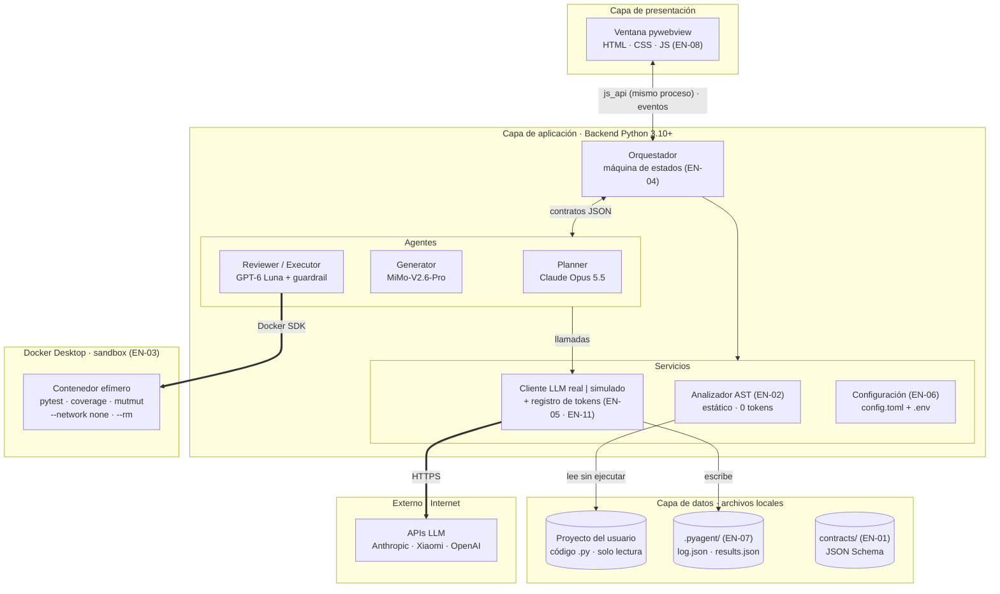
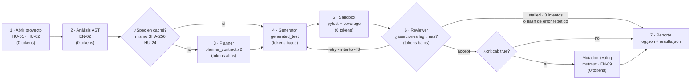
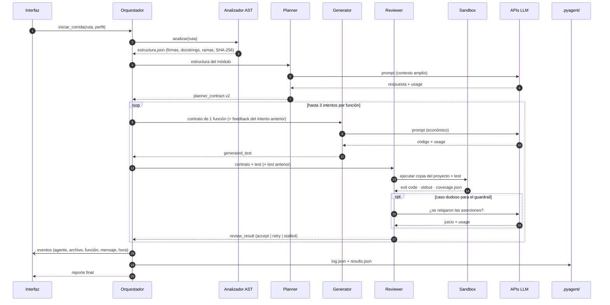
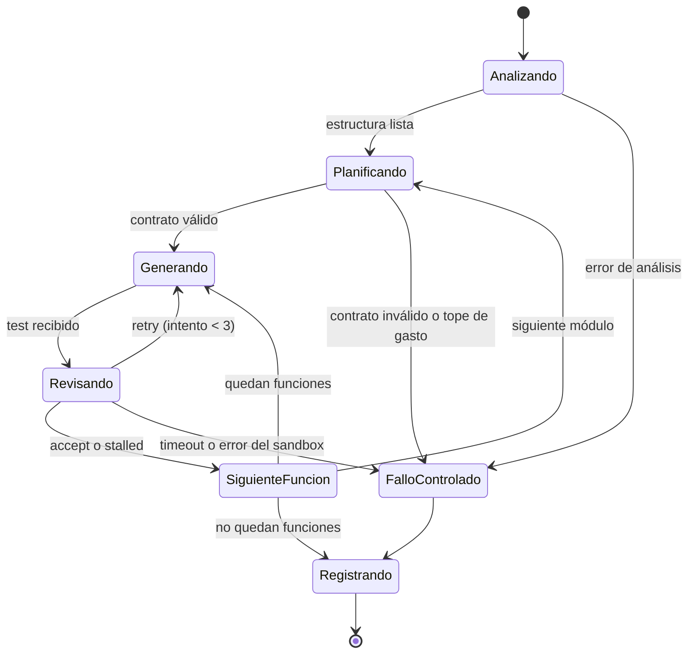
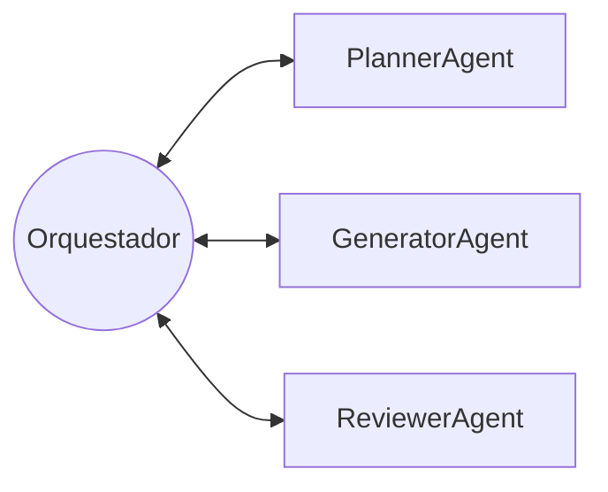

# Arquitectura de QAgent

> **Ítem:** EN-01 — Arquitectura GAIA y contratos JSON · **Responsable:** Oncoy Patricio, Angel · **Estado:** borrador para aprobación del equipo

QAgent genera y valida pruebas unitarias pytest para código Python 3.10+. Tres agentes basados en LLM (Planner, Generator y Reviewer) trabajan bajo un orquestador determinista, y las pruebas se ejecutan en un sandbox Docker aislado.

**Contenido**

1. [Tipo de arquitectura](#1-tipo-de-arquitectura)
2. [Vista de componentes](#2-vista-de-componentes)
3. [Pipeline de una corrida](#3-pipeline-de-una-corrida)
4. [Flujo de información](#4-flujo-de-información)
5. [Máquina de estados del orquestador](#5-máquina-de-estados-del-orquestador)
6. [Modelo GAIA](#6-modelo-gaia)
7. [Contratos JSON](#7-contratos-json)
8. [Stack tecnológico](#8-stack-tecnológico)
9. [Aprobación](#9-aprobación)

---

## 1. Tipo de arquitectura

**Aplicación de escritorio local en capas, con un pipeline multiagente orquestado.**

| Decisión | Motivo |
|---|---|
| **Escritorio local** (pywebview + backend Python) | Cada usuario corre QAgent sobre su propio proyecto. No hace falta servidor, cuentas ni base de datos central. |
| **Interfaz y backend en el mismo proceso** | pywebview expone funciones Python a JavaScript directamente (`js_api`). No hay servidor HTTP propio ni API REST. |
| **No es cliente-servidor** | La única relación cliente-servidor es hacia afuera: el backend es cliente de las APIs de los LLM (HTTPS) y del motor de Docker (socket local). |
| **Orquestador determinista** | Los agentes no se hablan entre sí. El orquestador pasa los contratos JSON y controla reintentos, topes de gasto y fallos. No usa LLM. |
| **Sandbox Docker** | Las pruebas generadas son código que no conocemos de antemano. Docker las aísla de los archivos, las dependencias y la red de la máquina del usuario: contenedor efímero (`--rm`), sin red (`--network none`), 1 CPU, 256 MB y 60 s por prueba. |
| **Datos en archivos** (`.pyagent/` dentro del proyecto) | Las corridas, specs y pruebas aprobadas viajan con el proyecto del usuario. No hace falta instalar una base de datos. |

---

## 2. Vista de componentes

**Reglas que muestra el diagrama**

- Los agentes solo se conectan con el orquestador. No hay flechas entre Planner, Generator y Reviewer.
- El Reviewer es el **único** componente que ejecuta código, y siempre dentro del contenedor.
- El Analizador AST lee el código del usuario **sin ejecutarlo**.
- La única salida a internet con datos del proyecto es el Cliente LLM hacia las APIs. El sandbox no tiene red.
- Clonar un repositorio público (HU-02) usa `git clone` desde el backend; no aparece en el diagrama para no recargarlo.

---

## 3. Pipeline de una corrida

Cada función pública pasa por estas etapas. Entre paréntesis, dónde se gastan tokens.

| Etapa | Qué produce | Métrica que alimenta |
|---|---|---|
| Sandbox | exit code, stdout/stderr, `coverage.json` | Pass Rate, cobertura de líneas y ramas |
| Reviewer | `review_result` con n.º de intento | Iteraciones de autorreparación |
| Cliente LLM | `usage` de cada llamada | Tokens por agente (`prompt_tokens` + `completion_tokens`) |
| Mutation testing | mutantes muertos / totales | Mutation Score (solo funciones críticas) |

---

## 4. Flujo de información

Mensajes, en orden, para una función. Las llamadas al LLM pasan por el Cliente LLM, que registra el `usage`.

---

## 5. Máquina de estados del orquestador

Base para EN-04.

- **Fallo controlado:** la corrida no se cuelga. Se registra el motivo y se escriben `log.json` y `results.json` con lo que se alcanzó a procesar.
- **Tope de gasto:** antes de cada llamada al LLM, el orquestador compara el gasto acumulado con `tope_por_corrida_usd` de `config.toml`.

---

## 6. Modelo GAIA

QAgent se modela con la metodología GAIA (Wooldridge, Jennings y Kinny): primero el **análisis** (modelo de roles y modelo de interacción) y luego el **diseño** (modelo de agentes, de servicios y de conocidos).

Hay **cuatro roles**: tres implementados con LLM (Planner, Generator y Reviewer) y un **Coordinador** determinista, que implementa el orquestador.

**Notación de las expresiones de vida (liveness):** `x . y` = x seguido de y · `x | y` = x o y · `x*` = cero o más veces · `x+` = una o más veces · `[x]` = opcional. Las actividades internas van en *cursiva* y los protocolos en texto normal.

### 6.1 Modelo de roles

#### Rol: Planner

| Campo | Contenido |
|---|---|
| **Descripción** | Analiza la estructura de un módulo y diseña los casos de prueba de cada función pública, con su valor esperado. |
| **Protocolos y actividades** | SolicitarPlan, *LeerEstructura*, *DerivarCasos*, *AsignarOráculo*, *ValidarContrato*, EntregarContrato |
| **Permisos** | Lee: `estructura.json` del módulo (firmas, tipos, docstrings, ramas). Genera: `planner_contract.v2`. No puede ejecutar ni importar el código del usuario. |
| **Liveness** | `PLANNER = (SolicitarPlan . LeerEstructura . DerivarCasos . AsignarOráculo . ValidarContrato . EntregarContrato)*` |
| **Safety** | • El contrato valida contra `planner_contract.v2.schema.json`. • Cada valor esperado declara su origen (firma, tipo o docstring). • Nunca ejecuta el código del usuario. |

#### Rol: Generator

| Campo | Contenido |
|---|---|
| **Descripción** | Escribe el archivo pytest de una función a partir de su contrato. En un reintento, corrige el test usando el feedback del Reviewer. |
| **Protocolos y actividades** | SolicitarTest, *RedactarTest*, *IncorporarFeedback*, *ValidarSintaxis*, EntregarTest |
| **Permisos** | Lee: el contrato de **una** función y el feedback del intento anterior. Genera: `generated_test`. No ve el resto del repositorio ni importa el módulo objetivo para calcular valores. |
| **Liveness** | `GENERATOR = (SolicitarTest . [IncorporarFeedback] . RedactarTest . ValidarSintaxis . EntregarTest)*` |
| **Safety** | • Las aserciones usan los valores esperados del contrato. • El código pasa `ast.parse` antes de entregarse. • intento ≤ 3. |

#### Rol: Reviewer / Executor

| Campo | Contenido |
|---|---|
| **Descripción** | Ejecuta el test en el sandbox, verifica que las aserciones sean legítimas (sin Assertion Laundering) y decide si se acepta, se reintenta o se detiene. |
| **Protocolos y actividades** | SolicitarRevisión, *EjecutarEnSandbox*, *CompararAserciones*, *JuzgarAserciones*, *CalcularHashError*, *Decidir*, EntregarVeredicto |
| **Permisos** | Lee: contrato, test actual, test anterior y `coverage.json`. Ejecuta: el test **solo dentro del sandbox** (único rol con permiso de ejecución). Genera: `review_result`. |
| **Liveness** | `REVIEWER = (SolicitarRevisión . EjecutarEnSandbox . CompararAserciones . [JuzgarAserciones] . CalcularHashError . Decidir . EntregarVeredicto)*` |
| **Safety** | • Nunca acepta un test cuyas aserciones se debilitaron respecto al contrato o al intento anterior. • Devuelve `stalled` si intento = 3 o si el hash del error normalizado se repite dos veces seguidas. • Toda ejecución es con `--network none`. |

`CompararAserciones` es el guardrail determinista, que compara el AST de las aserciones. `JuzgarAserciones` (LLM) solo se usa cuando el guardrail no puede decidir.

#### Rol: Coordinador (orquestador, sin LLM)

| Campo | Contenido |
|---|---|
| **Descripción** | Dirige la corrida: analiza el proyecto, reparte el trabajo a los roles, aplica los límites y registra todo. |
| **Protocolos y actividades** | SolicitarPlan, SolicitarTest, SolicitarRevisión, NotificarEvento, *AnalizarProyecto*, *ControlarGasto*, *RegistrarCorrida* |
| **Permisos** | Lee: `config.toml`, estructura del proyecto y todos los contratos. Genera: `log.json`, `results.json` y eventos para la interfaz. |
| **Liveness** | `COORDINADOR = AnalizarProyecto . (SolicitarPlan . (SolicitarTest . SolicitarRevisión)+)+ . RegistrarCorrida` |
| **Safety** | • Gasto acumulado ≤ tope por corrida. • Todo mensaje entre roles pasa por él (sin broadcast). • Un error o timeout del sandbox termina en fallo controlado. |

### 6.2 Modelo de interacción

| Protocolo | Iniciador | Respondedor | Entrada | Salida | Propósito |
|---|---|---|---|---|---|
| SolicitarPlan | Coordinador | Planner | estructura del módulo | `planner_contract.v2` | Obtener los casos de prueba de un módulo |
| SolicitarTest | Coordinador | Generator | contrato de 1 función (+ feedback) | `generated_test` | Obtener o corregir el test de una función |
| SolicitarRevisión | Coordinador | Reviewer | contrato + test (+ test anterior) | `review_result` | Ejecutar y validar el test; decidir el siguiente paso |
| NotificarEvento | Coordinador | Interfaz | — | evento (agente, archivo, función, mensaje, hora) | Mostrar el avance en el Monitor en vivo (HU-09) |

Los tres protocolos son de **petición-respuesta**: el Coordinador espera la salida antes de continuar. NotificarEvento es asíncrono y no espera respuesta.

### 6.3 Modelo de agentes

| Tipo de agente | Rol que cumple | Instancias por corrida | Modelo |
|---|---|---|---|
| PlannerAgent | Planner | 1 | Claude Opus 5.5 (fase de arranque: MiMo-V2.6-Pro, ver ADR-001) |
| GeneratorAgent | Generator | 1 | MiMo-V2.6-Pro |
| ReviewerAgent | Reviewer / Executor | 1 | GPT-6 Luna + guardrail determinista |
| Orquestador | Coordinador | 1 | Sin LLM |

Cada rol lo cumple un solo tipo de agente. Las funciones se procesan una tras otra, así que una instancia de cada agente es suficiente en la Fase 1.

### 6.4 Modelo de servicios

| Servicio | Agente | Entradas | Salidas | Precondición | Postcondición |
|---|---|---|---|---|---|
| Planificar módulo | PlannerAgent | estructura del módulo | `planner_contract.v2` | el módulo se analizó sin error de sintaxis | contrato válido contra su schema; cada caso tiene origen del valor esperado |
| Generar test | GeneratorAgent | contrato de 1 función, feedback opcional | `generated_test` | contrato válido; intento ≤ 3 | el código pasa `ast.parse` |
| Revisar test | ReviewerAgent | contrato, test, test anterior opcional | `review_result` | el sandbox está disponible | decisión en {accept, retry, stalled}; métricas del intento registradas |
| Coordinar corrida | Orquestador | ruta del proyecto, perfil | `log.json`, `results.json` | configuración válida y entorno listo (EN-06) | ambos archivos validan contra `run_log.schema.json` |

### 6.5 Modelo de conocidos

Quién puede comunicarse con quién. El único nodo conectado con todos es el Orquestador.

No existe ninguna comunicación directa entre PlannerAgent, GeneratorAgent y ReviewerAgent.

---

## 7. Contratos JSON

Los schemas completos van en `contracts/` y los valida `tests/test_contracts.py`. El origen del valor esperado es la firma, los tipos o el docstring de una función, o la declaración de la ruta (`response_model`, `status_code`, modelos Pydantic) de un endpoint. El análisis usa solo `ast` (ver ADR-002).

| Contrato | De → a | Campos principales | Schema |
|---|---|---|---|
| `estructura.json` | Analizador AST → Orquestador / Planner | módulos, funciones (firma, tipos, docstring, n.º de ramas, `llama_a`), endpoints FastAPI (método, ruta, `response_model`, `status_code`), SHA-256 por módulo | salida de EN-02 / EN-14 |
| `planner_contract.v2` | Planner → Generator (vía orquestador) | módulo, `tipo` (`funcion` \| `endpoint`), función o ruta, firma, `critical`, casos: [id, entrada, valor esperado, origen del valor esperado] | `planner_contract.v2.schema.json` |
| `generated_test` | Generator → Reviewer (vía orquestador) | función, intento, código pytest, ids de casos cubiertos | `generated_test.schema.json` |
| `review_result` | Reviewer → Orquestador | función, intento, estado del sandbox, cobertura, laundering detectado, hash del error, decisión, feedback | `review_result.schema.json` |
| `log.json` / `results.json` | Orquestador → `.pyagent/` | modelos usados, perfil, llamadas con tokens por agente, costo, 5 métricas por función | `run_log.schema.json` |

---

## 8. Stack tecnológico

| Capa | Tecnología | Uso | Ítem |
|---|---|---|---|
| Presentación |    | Pantallas del demo | EN-08 |
| Presentación | pywebview | Ventana de escritorio y puente JS ↔ Python | EN-08 |
| Backend |  | Orquestador, agentes y servicios | EN-04 |
| Backend | `ast` (biblioteca estándar) | Análisis estático del código | EN-02 |
| Configuración |  `tomllib` | `config.toml` | EN-06 |
| IA |  | Planner | SPK-01 |
| IA |  | Generator (y Planner en la fase de arranque) | SPK-01 |
| IA |  | Reviewer | SPK-01 |
| Sandbox |  | Contenedor aislado | EN-03 |
| Métricas |  coverage.py · mutmut | Ejecución, cobertura y Mutation Score | EN-03 · EN-09 |
| Contratos |  `jsonschema` | Validación de contratos y logs | EN-01 |
| Equipo |     | Versiones, PRs, CI y lint | — |

---

## 9. Aprobación

Criterio 5 de EN-01: aprobado por los 4 integrantes (se marca al aprobar el PR).

- [ ] Castillo Pezo, Mateo
- [ ] Oncoy Patricio, Angel
- [ ] Rodríguez Malca, Rodrigo
- [ ] Sanchez Vargas, Adrián
