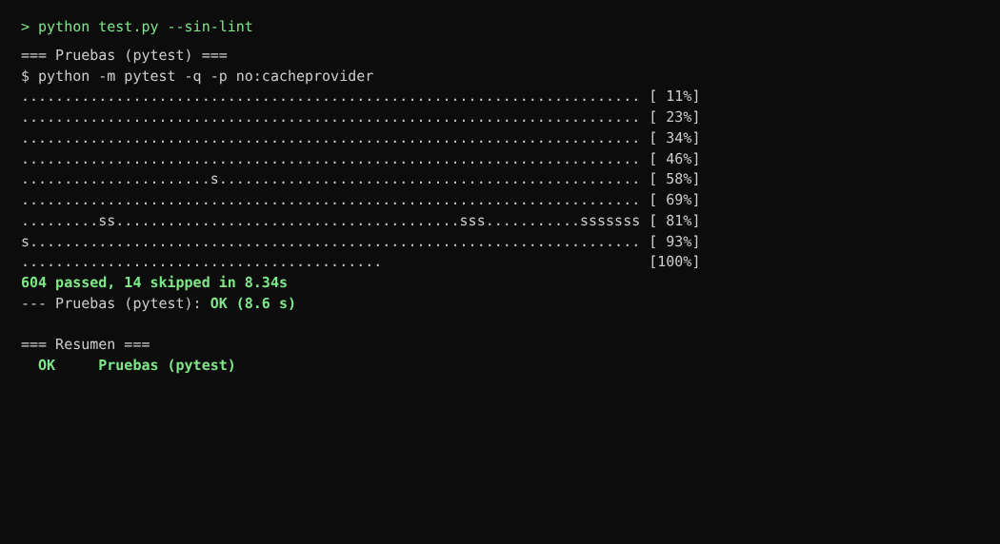
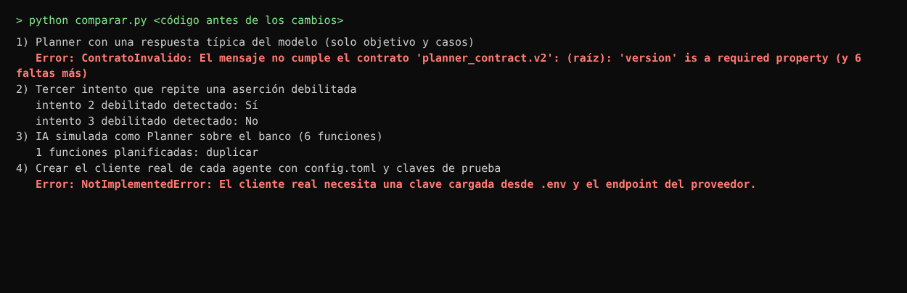
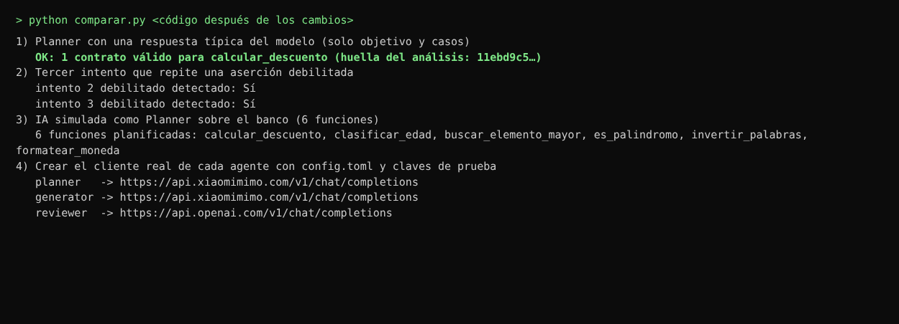
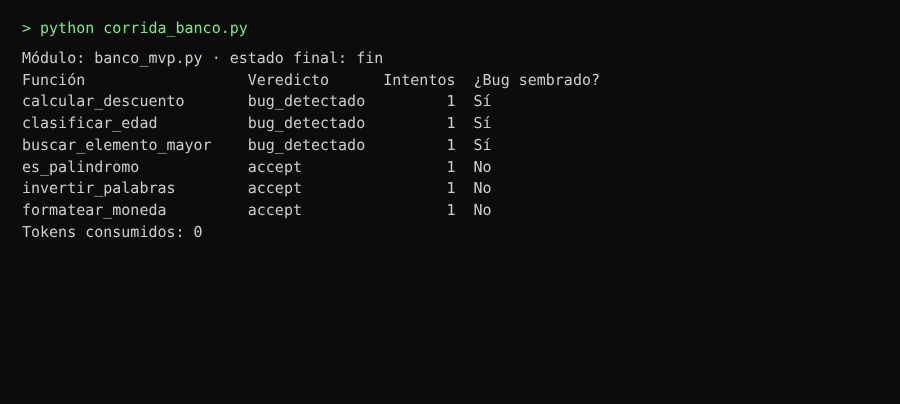

# HU-11 · Los agentes ya funcionan con la IA real y con la simulada

**Informe de lo realizado** · 10 de octubre de 2026 · Responsable: Oncoy Patricio, Angel

## En pocas palabras

Los tres agentes de HU-11 (Planner, Generator y Reviewer) existían, pero no podían trabajar con un modelo de IA real: el Planner esperaba una respuesta que el modelo no sabía dar, el programa no tenía cómo conectarse a los proveedores y la IA simulada no servía para ensayar sobre el banco de pruebas. Se corrigió todo eso. Ahora el sistema recorre el banco completo y encuentra los 3 errores sembrados sin gastar dinero.

## Qué se revisó y qué se hizo

**1. Cómo el Planner pide los casos de prueba al modelo.**
*Se revisó:* el Planner pedía al modelo el contrato completo de cada función (8 datos obligatorios, entre ellos la huella del archivo), sin explicarle el formato. Con una respuesta típica del modelo, el contrato no pasaba la revisión (7 errores, por datos que faltaban) y la corrida se detenía (prueba 2).
*Se hizo:* ahora el modelo solo propone los casos (qué se envía a la función y qué debe devolver), con un ejemplo del formato. El resto lo completa el sistema con lo que ya sabe del código, así que el modelo no puede inventar esos datos y se le envía menos texto (menor costo).

**2. Qué pasa cuando el modelo escribe un caso mal.**
*Se revisó:* un solo caso mal escrito, o una función que no existe en el archivo, detenía la revisión de todo el archivo.
*Se hizo:* esos casos se descartan y quedan anotados con el motivo; la revisión sigue con los demás. Solo se detiene si no queda ningún caso válido.

**3. Conexión con los servicios de IA reales.**
*Se revisó:* el programa no tenía la dirección de ningún proveedor ni una forma de armar la conexión a partir de la configuración del equipo (`config.toml`).
*Se hizo:* se agregaron las direcciones de los 4 proveedores previstos (OpenAI, Xiaomi MiMo, Anthropic y OpenRouter) y una pieza que crea la conexión de cada agente con su modelo y su clave. Cada agente puede usar otra dirección o un nivel de razonamiento distinto si se escribe en `config.toml`.

**4. La IA simulada (modo sin costo).**
*Se revisó:* respondía siempre con la misma función inventada («duplicar»), sin importar el proyecto abierto; sobre el banco planificaba 1 función que no existe en él (prueba 2).
*Se hizo:* se escribieron a mano 17 casos para las 6 funciones del banco, tomando el resultado esperado de la documentación de cada función, nunca de ejecutarla (`bench/ia_simulada.json`). La IA simulada ahora arma las pruebas a partir de esos casos, con costo cero.

**5. Detección de pruebas debilitadas a propósito.**
*Se revisó:* si el intento 2 debilitaba una prueba, se rechazaba; pero el intento 3 se comparaba contra ese intento 2 ya debilitado, y repetir el mismo truco pasaba sin aviso (prueba 2).
*Se hizo:* cada intento se compara con la última versión que **no** fue debilitada.

**6. Pruebas que no se pueden recolectar.**
*Se revisó:* si el archivo generado no tenía ninguna prueba reconocible, la revisión de todo el archivo se detenía.
*Se hizo:* ahora se trata como un error de la prueba escrita y se pide otro intento.

**7. Instrucciones al Generator.**
*Se revisó:* no se le decía cómo importar la función del proyecto, y en cada reintento se le reenviaba el mensaje de error completo, sin límite.
*Se hizo:* se le da la línea exacta para importar la función y solo los últimos 2000 caracteres del error, que es donde está la causa. Eso evita intentos fallidos y reduce el gasto.

**8. Pruebas automáticas del sistema.**
*Se revisó:* había 584 pruebas automáticas aprobadas.
*Se hizo:* se agregaron 20 que cubren los puntos anteriores (604 aprobadas), más 1 que hace la corrida completa del banco dentro del entorno aislado (Docker) y que se omite sola si Docker no está abierto.

## Para qué se hizo

- Que la primera corrida con un modelo real no se detenga en el Planner por un formato que el modelo no conocía.
- Ensayar la corrida del MVP (EV-01) las veces que haga falta sin gastar del presupuesto.
- Que el sistema no deje pasar una prueba debilitada solo porque el intento anterior ya estaba debilitado.
- Dejar listas las piezas para conectar la corrida a la pantalla, que es la siguiente tarea.

## Pruebas realizadas

### Prueba 1 · Todas las pruebas automáticas siguen aprobadas

Se ejecutaron todas las pruebas automáticas del proyecto con la IA simulada. **Resultado:** 604 aprobadas y 14 omitidas, ninguna fallida. Las omitidas necesitan Docker o internet, que no estaban disponibles en el equipo donde se corrieron.

### Prueba 2 · Las mismas cuatro comprobaciones antes y después del cambio

*Antes:*

*Después:*

Se ejecutó el mismo programa de comprobación sobre una copia del código tal como estaba antes (última versión guardada en `develop`) y sobre el código nuevo. Se usaron claves inventadas («claves de prueba»), por lo que no se llamó a ningún servicio real. **Resultado:**
- Respuesta típica del modelo: antes fallaba con 7 errores por datos faltantes; ahora produce un contrato válido.
- Tercer intento debilitado: antes no se detectaba; ahora sí.
- IA simulada sobre el banco: antes planificaba 1 función que no existe; ahora planifica las 6.
- Conexión a los proveedores: antes no se podía crear; ahora cada agente tiene su dirección.

### Prueba 3 · El sistema encuentra los 3 errores sembrados en el banco

Se hizo una corrida completa (Planner → Generator → Reviewer) sobre el banco con la IA simulada. **Resultado:** las 3 funciones con error sembrado salieron como «bug_detectado» y las 3 correctas como «accept», todas al primer intento y con 0 tokens consumidos. Esta corrida usó una copia temporal del banco y ejecutó las pruebas fuera de Docker, porque el equipo de verificación no tenía Docker; la versión oficial dentro del entorno aislado es la prueba `tests/orchestrator/test_hu11_banco_simulado.py`.

## Pendiente (otra tarea)

- **Correr la prueba del banco con Docker** en una PC con Docker Desktop abierto (`python test.py --sin-lint -k banco_simulado`) para confirmar el resultado de la prueba 3 dentro del entorno aislado.
- **Nivel de razonamiento del Reviewer:** `config.toml` tiene `esfuerzo = "max"` y ahora se envía a OpenAI. Si el servicio no acepta ese valor, hay que cambiarlo a `"high"` o quitarlo.
- **Pruebas que tardan más de 60 segundos:** todavía detienen la revisión de todo el archivo. Corresponde al orquestador (EN-04).
- **Cobertura:** se mide sobre el archivo completo y no sobre cada función, por eso salen valores bajos.
- **Conectar la corrida a la pantalla** (al pulsar «Iniciar corrida»): siguiente tarea.
