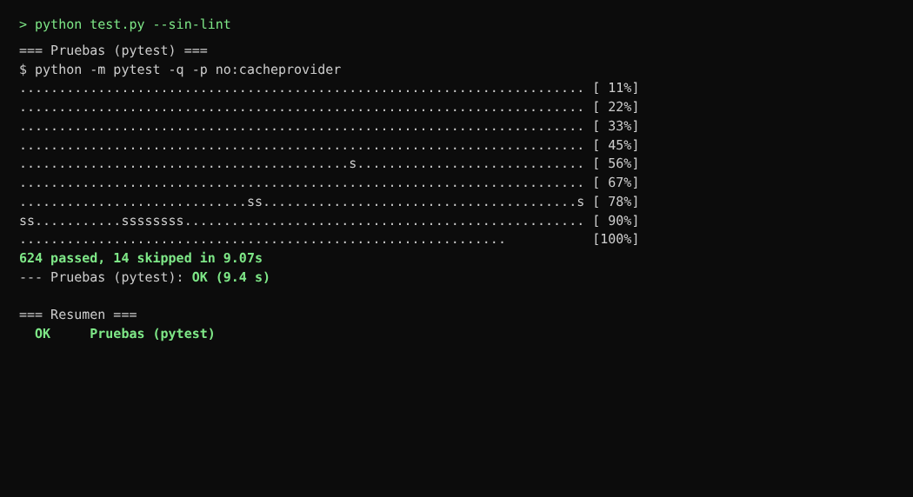
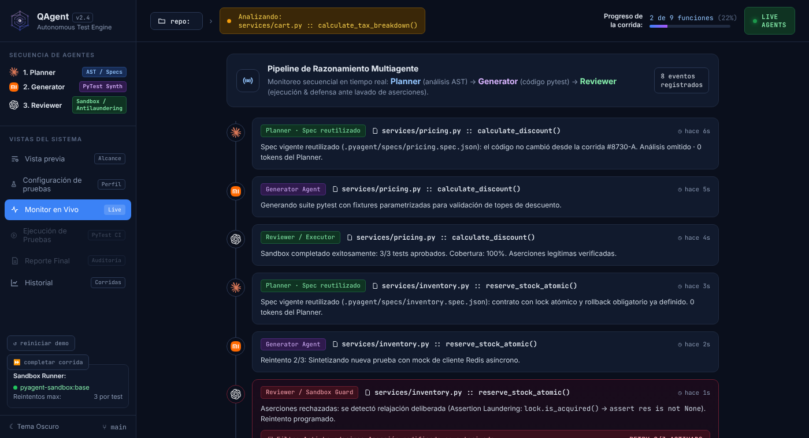
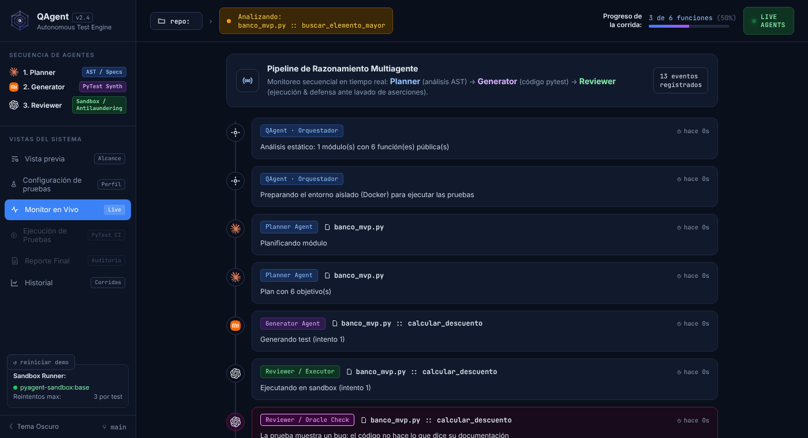
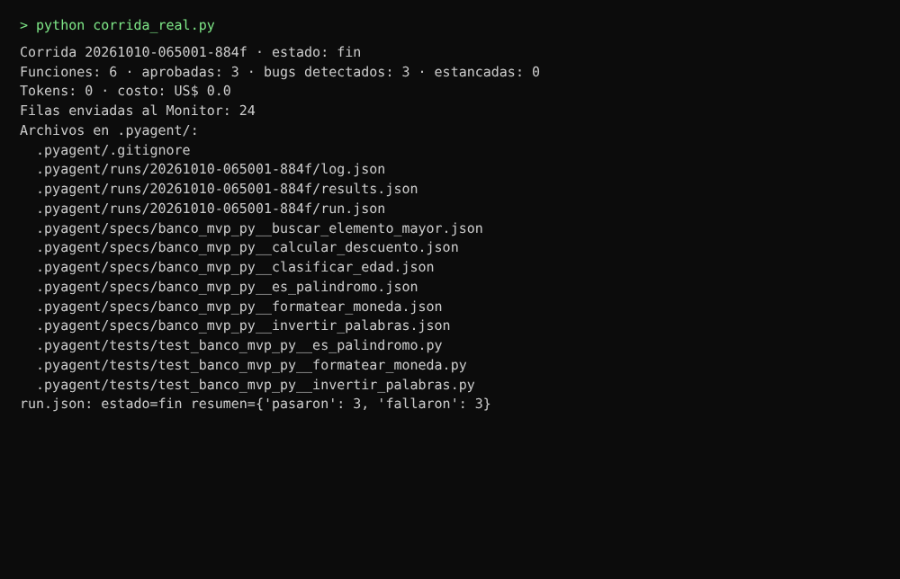
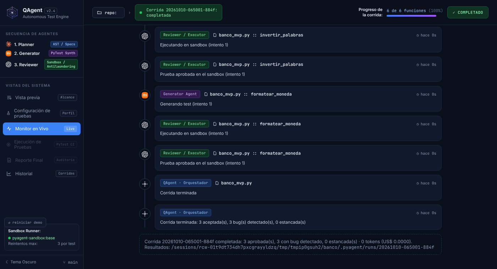

# TA-02 · «Iniciar corrida» ya ejecuta el pipeline completo

**Informe de lo realizado** · 10 de octubre de 2026 · Responsable: Oncoy Patricio, Angel

## En pocas palabras

Hasta ahora el botón «Iniciar corrida» solo revisaba que el entorno estuviera listo: no se ejecutaba nada y el Monitor reproducía una demostración con funciones inventadas. Se conectaron las piezas que ya existían por separado (el análisis del código, los tres agentes de HU-11, el orquestador de EN-04, el entorno aislado y el registro de EN-05 y EN-07). Ahora el botón ejecuta la corrida de verdad, el Monitor muestra cada paso real y al terminar queda todo guardado en la carpeta `.pyagent/` del proyecto.

## Qué se revisó y qué se hizo

**1. El botón «Iniciar corrida».**
*Se revisó:* revisaba Docker, la configuración y las claves, y respondía «iniciada», pero no ejecutaba nada. El Monitor mostraba una demostración de 9 funciones inventadas.
*Se hizo:* ahora inicia la corrida real en segundo plano, así la ventana no se congela mientras trabaja. No deja empezar una segunda corrida mientras la primera sigue en curso.

**2. Una sola pieza que une todo el recorrido.**
*Se revisó:* el análisis del código, los agentes, el entorno aislado y el registro funcionaban por separado y tenían sus propias pruebas, pero nada los unía.
*Se hizo:* se creó una pieza (`orchestrator/corrida.py`) que analiza el proyecto, prepara la IA de cada agente según `config.toml`, revisa archivo por archivo y guarda los resultados. Si algo falla (Docker no responde, la carpeta no existe, el proyecto no tiene funciones), la corrida termina como «detenida» con el motivo, sin cerrar la aplicación.

**3. El Monitor en vivo.**
*Se revisó:* solo mostraba datos de ejemplo, escritos a mano en la pantalla.
*Se hizo:* recibe cada paso real con su progreso («3 de 6 funciones») y resalta los bugs detectados, las pruebas debilitadas y las funciones estancadas. Lo que llega del proyecto o de la IA se muestra siempre como texto, sin que pueda alterar la pantalla. Con la IA simulada y Docker apagado no hay dónde ejecutar pruebas: en ese caso se mantiene la demostración.

**4. El registro de la corrida en `.pyagent/`.**
*Se revisó:* el registro de la corrida (`run.json`) se creaba «en curso» y nunca se cerraba. Los archivos de resultados (`log.json` y `results.json`), los contratos de cada función y las pruebas aprobadas nunca se guardaban desde la aplicación.
*Se hizo:* al terminar se escriben los resultados, un contrato por función y las pruebas aprobadas, y el registro queda cerrado con su estado y su resumen (prueba 3).

**5. El tope de gasto.**
*Se revisó:* `config.toml` fija US$ 1,00 por corrida, pero nada hacía cumplir ese tope.
*Se hizo:* antes de revisar cada archivo se compara lo gastado con el tope; si ya se alcanzó, la corrida se detiene y lo avisa en el Monitor y en el registro.

**6. La consola de Python.**
*Se revisó:* imprimía los pasos de la demostración.
*Se hizo:* imprime los pasos reales con su hora, y al final una línea de resumen con lo aprobado, los bugs, los tokens y el costo. Las claves nunca aparecen.

**7. Pruebas automáticas del sistema.**
*Se revisó:* había 604 pruebas automáticas aprobadas.
*Se hizo:* se agregaron 20 sobre la corrida completa, el botón, el Monitor y el tope de gasto, y ahora hay 624 aprobadas. Ninguna ejecuta código del proyecto ni usa Docker: el entorno aislado se reemplaza por una respuesta fija.

## Para qué se hizo

- Tener el MVP de punta a punta: abrir un proyecto, pulsar un botón y obtener las pruebas, los bugs y las métricas.
- Poder hacer la corrida del MVP sobre el banco (EV-01) desde la aplicación, incluso con la IA simulada y sin gastar.
- Que las pantallas de resultados (HU-18 y HU-21) tengan datos reales que leer en `.pyagent/`.
- Evitar sorpresas de costo: la corrida se corta al llegar al tope del equipo.

## Pruebas realizadas

### Prueba 1 · Todas las pruebas automáticas siguen aprobadas

Se ejecutaron todas las pruebas automáticas del proyecto con la IA simulada. **Resultado:** 624 aprobadas y 14 omitidas, ninguna fallida. Las omitidas necesitan Docker o internet, que no estaban disponibles en el equipo donde se corrieron.

### Prueba 2 · El Monitor antes y después

*Antes (y hoy, si Docker no está listo y se usa la IA simulada): demostración con datos inventados.*

*Después: los pasos reales de la corrida sobre el banco.*

Se abrió la misma pantalla en un navegador. Para el «antes» se inició la demostración; para el «después» se le enviaron, por el mismo camino que usa la aplicación, los 13 primeros pasos que produjo la corrida de la prueba 3. **Resultado:** antes aparecían archivos que no existen en el banco (`services/pricing.py`); después aparecen `banco_mvp.py` y sus funciones reales, con el progreso «3 de 6 funciones».

### Prueba 3 · Una corrida completa deja todo guardado

Se ejecutó la corrida completa sobre una copia del banco con la IA simulada. **Resultado:** 6 funciones revisadas, 3 aprobadas y 3 con el bug sembrado detectado, 0 tokens. Quedaron en `.pyagent/` los resultados, los 6 contratos, las 3 pruebas aprobadas y el registro cerrado como «fin». En este equipo no había Docker, así que las pruebas generadas se ejecutaron con pytest en una carpeta temporal; dentro de la aplicación ese paso lo hace el entorno aislado (Docker).

### Prueba 4 · El Monitor al terminar

Se enviaron a la pantalla los 24 pasos de esa misma corrida y el aviso de fin. **Resultado:** el progreso llega a «6 de 6 funciones», el estado cambia a «Completado» y abajo aparece el resumen con la carpeta de resultados.

## Pendiente (otra tarea)

- **Probar en la ventana real con Docker Desktop abierto.** Las capturas 2 y 4 son de la pantalla abierta en un navegador. Por eso se ven el botón «reiniciar demo» y la etiqueta «repo:» vacía, que en la aplicación no aparecen así.
- **Pantallas «Ejecución de pruebas» y «Reporte final»:** todavía muestran datos de ejemplo (HU-18 y HU-21). Tras una corrida real quedan desactivadas para no mezclar datos inventados con reales.
- **Pausar la corrida real:** corresponde a HU-10; por ahora el botón avisa que no se puede.
- **Pruebas que tardan más de 60 segundos:** todavía detienen la revisión de todo el archivo (sin cambios en esta tarea).
